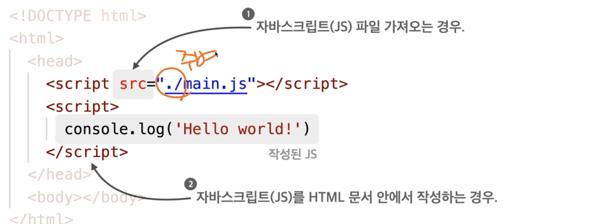

---
​---
layout: post
title: 11/29~12/3 2주차 워크시트!
date: 2021-12-03 
categories: javascript part1
​---

---


# 웹 사이트 뼈대 만들기

## JavaScript


### `JavaScript` 

```
indexOf 함수
```

> 특정 값이 배열의 몇 번째 요소인지 반환
>
> 없을 시 `-1` 반환

 - ㅇㅁㄴㅇ

 - ds

   

### `push` 함수

> 배열에 요소를 삽입한다.

```javascript
var myArray = [];
console.log(myArray);

myArray.push(1);
console.log(myArray);   => myArray 1 대입. myArray.length 길이는 3.

myArray.push(3);
myArray.push(5);
console.log(myArray);
```


### `conact ` 함수

> 다른 배열을 이어붙인 배열을 반환

```
myNumberArray = [1,2,3,4]
myNumberArray = [0].concat(myNumberArray) 
///var myNumberArray2 = mynuberArray.concat([0]);  형식도 가능.
console.log(myNumberArray)
[1,2,3,4] => [0,1,2,3,4]
```


### `for`문

> **형식 {초기화 : 조건 : 작업 후 처리}**

```
for( var i=0; i<5; i++){
console.log(i);
}
```

실행순서

1. var i=0;

2. 5보다 작으므로 console.log(i) 실행. 출력.

3. i++ 실행. 1로 상승.

4. 결과 

   ``` 0
   0
   1
   2
   3
   4
   ```

   


### 배열을 `for` 문으로 다루기

```
var oddArray = [];
var evenArray = [];

for (var i = 10; i <= 20; i++) {
  if (i % 2 === 0) {
    evenArray.push(i);
  } else {
    oddArray.push(i);
  }
}

console.log(oddArray);
console.log(evenArray);
```

> evenArray에 넣어준다. if문 값을.
>
> 그 이외 나머지는 oddArray에 넣어준다. 


### 함수와 이벤트

```
function insertThisTime () {
  var ulEl = document.querySelector("ul");
  var liEl = document.createElement("li");
  liEl.append(new Date());
  ulEl.append(liEl);
```

> 두개가 같은 코드 이다. 서식만 다를뿐.

```
var insertThisTime = function () {
  var ulEl = document.querySelector("ul");
  var liEl = document.createElement("li");
  liEl.append(new Date());
  ulEl.append(liEl);
}
```

## 이벤트

> 특정 요소 클릭 시 이벤트

```html
<button onclick="insertThisTime();">현 시각 기록</button>
<ul></ul>
function insertThisTime () {
  var ulEl = document.querySelector("ul");
  var liEl = document.createElement("li");
  liEl.append(new Date());
  ulEl.append(liEl);
}
```

> 요소 로드 완료시 이벤트
>
> - body에 붙일 경우 페이지의 모든 요소들(이미지, js, css 파일 등) 로드 후 실행

```html
<body onload="sayPageIsLoaded();">
  <h1></h1>
</body>
function sayPageIsLoaded () {
  document.querySelector("h1").innerHTML = "페이지 로드 완료!"
}
```

---

---

### 팀 배정 프로그램 만들어보기

```html
<h1>팀 배정</h1>
<table>
  <tr>
    <td colspan="3" id="not_assigned"></td>
  </tr>
  <tr>
    <td>1팀</td>
    <td>2팀</td>
    <td>3팀</td>
  </tr>
  <tr>
    <td>
      <button>배정</button>
      <ul id="team_1"></ul>
    </td>
    <td>
      <button>배정</button>
      <ul id="team_2"></ul>
    </td>
    <td>
      <button>배정</button>
      <ul id="team_3"></ul>
    </td>
  </tr>
</table>
body { padding: 8px 24px; }
table { width: 400px; }
td {
  padding: 12px 16px;
  border: 1px solid gray;

}
ul { list-style: none; }
button {
  font-size: 1rem;
}
var members = [
  '손흥민', '김영권', '이승우', '기성용', '황희찬', 
  '황희조', '구자철', '이용', '조현우', '김승규',
  '이강인', '박주호', '문선민', '김민재', '황인범', 
  '이정협', '김인성', '구성윤', '장현수', '나상호'
];
```


> 배정되지 않은 멤버들 표시 함수

```javascript
function showNotAssigneds () {
  var membersString = '';
  for (var i = 0; i < members.length; i++) {
    membersString += members[i];
    if (i < members.length - 1) membersString += ', ';
  }
  document.querySelector('#not_assigned').innerHTML = membersString;
}
```


> 페이지 로드시 실행

```html
<body onload="showNotAssigneds();">
```


> 목록 앞에서부터 한 명씩 빼서 원하는 팀에 배정

```javascript
function assignMemberToTeam (teamNumber) {
  if (members.length === 0) return;
  var member = members[0];
  member = members.splice(0, 1);
  showNotAssigneds();

  var liEl = document.createElement("li");
  liEl.append(member);
  document.querySelector("#team_" + teamNumber).append(liEl);
}
```


> 버튼에 함수 실행 이벤트 등록

```html
<button onclick="assignMemberToTeam(1)">배정</button>
<!-- ... -->
<button onclick="assignMemberToTeam(2)">배정</button>
<!-- ... -->
<button onclick="assignMemberToTeam(3)">배정</button>
```

## 스타일 제어하기

```
<div>MY DIV</div>
var divEl = document.querySelector("div"); => div
divEl.style.color = "blue"; => blue
document.querySelector("div").style = " red " => red 로 변경
```

```javascript
divEl.style.backgroundColor = "skyblue"; 배경 
divEl.style.padding = "24px 36px"; 폭사이즈
divEl.style.display = "inline-block"; 반대는 block
divEl.style.borderRadius = "12px"; 박스
divE1.style.fontWeight = "bold"; 글씨
```

## HTML 요소의 클래스 다루기

```html
<ul>
  <li><span>국어</span></li>
  <li><span>수학</span></li>
  <li><span>사회</span></li>
  <li><span>과학</span></li>
  <li><span>체육</span></li>
</ul>
  .highlighted span {
    background-color: yellowgreen;
  }
  .important span {
    font-weight: bold;
    color: blue;
  }
</style>
```


### 클래스 값 지정

`className` 속성에 값 대입

```javascript
document.querySelector("ul li:nth-child(3)").className = "highlighted";
document.querySelector("ul li:nth-child(3)").className = "important";
document.querySelector("ul li:nth-child(3)").className = "highlighted important";
```

### 클래스 추가 / 제거

`classList`의 `add`, `remove` 사용

```javascript
document.querySelector("ul li:nth-child(4)").classList.add("highlighted");
document.querySelector("ul li:nth-child(4)").classList.add("important");

// 이미 있는 클래스는 추가되지 않음
document.querySelector("ul li:nth-child(4)").classList.add("important");

document.querySelector("ul li:nth-child(3)").classList.remove("important");
```


### Last practice

=> Part 04. 나만의 사진 포트폴리오 만들기 참조


#### `toggleLike`함수

```javascript
function toggleLike(idx) {
  if (my_info.like.indexOf(idx) === -1) {// 내가 좋아요하지 않은 사진일 때
      my_info.like.push(idx); 			//my_info의 좋아요에 idx 를 푸쉬해서
      									// 해제 된 상태 유지.
	photos.forEach(function (phto) {     //
        if(photo.idx === idx) {  		//  // → 좋아요로 바꿈
            photo.lieks++;				//
        }
    });

  } else {
		my_info.like = my_info.fillter(function (photo){
        	return photo.idx !== idx; //
    });
    // 내가 좋아요 한 사진일 때
    // → 좋아요 해제

  }

  // 최종적용
  showPhotos();
}
```

---


## Firebase 호스팅

### 웹 호스팅

> 웹 사이트를 배포할 수 있도록 인터넷 망에 연결된 서버의 일정 공간을 임대해주는 서비스

- `호스팅` : 서버 임대 서비스
  - .html`, `.css`, `.js`, 이미지 등 정적 파일들을 업로드하여 외부에서 접근 가능하도록 함

### Firebase

> 서버에 직접 구현해야 했던 기능들을 대신해주는 서비스

- 호스팅,데이터베이스,파일저장,로그인 등


### Firebase 준비

- Node.js 설치

---

## HTML, CSS, JavaScript 심화 학습

main.js 파일을 만들고 본 코드에서 js 파일을 읽어올때는

<script src = ""</script>

형식으로 쓴다.

js 파일은 실행 시 Console 부분에 뜬다.

> `console.log(' 내가 맘대로 입력')`
>
> `콘솔`에 `로그`를 작성한다. 라는 뜻

```
<link rel ="" href="">
```

>외부 문서를 가져와 연결할 때 사용.(대부분 CSS파일)

rel : 가져올 문서와 관계 / href: 가져올 문서의 경로

