---

layout: post
title: "11/29~12/3 2주차 워크시트!"
date: 2021-12-03 
categories: javascript part1

---


# 웹 사이트 뼈대 만들기

## JavaScript


### `JavaScript` 

```
indexOf 함수
```

> 특정 값이 배열의 몇 번째 요소인지 반환
>
> 없을 시 `-1` 반환

 - ㅇㅁㄴㅇ

 - ds

   

### `push` 함수

> 배열에 요소를 삽입한다.

```javascript
var myArray = [];
console.log(myArray);

myArray.push(1);
console.log(myArray);   => myArray 1 대입. myArray.length 길이는 3.

myArray.push(3);
myArray.push(5);
console.log(myArray);
```


### `conact ` 함수

> 다른 배열을 이어붙인 배열을 반환

```
myNumberArray = [1,2,3,4]
myNumberArray = [0].concat(myNumberArray) 
///var myNumberArray2 = mynuberArray.concat([0]);  형식도 가능.
console.log(myNumberArray)
[1,2,3,4] => [0,1,2,3,4]
```


### `for`문

> **형식 {초기화 : 조건 : 작업 후 처리}**

```
for( var i=0; i<5; i++){
console.log(i);
}
```

실행순서

1. var i=0;

2. 5보다 작으므로 console.log(i) 실행. 출력.

3. i++ 실행. 1로 상승.

4. 결과 

   ``` 0
   0
   1
   2
   3
   4
   ```

   


### 배열을 `for` 문으로 다루기

```
var oddArray = [];
var evenArray = [];

for (var i = 10; i <= 20; i++) {
  if (i % 2 === 0) {
    evenArray.push(i);
  } else {
    oddArray.push(i);
  }
}

console.log(oddArray);
console.log(evenArray);
```

> evenArray에 넣어준다. if문 값을.
>
> 그 이외 나머지는 oddArray에 넣어준다. 


### 함수와 이벤트

```
function insertThisTime () {
  var ulEl = document.querySelector("ul");
  var liEl = document.createElement("li");
  liEl.append(new Date());
  ulEl.append(liEl);
```

> 두개가 같은 코드 이다. 서식만 다를뿐.

```
var insertThisTime = function () {
  var ulEl = document.querySelector("ul");
  var liEl = document.createElement("li");
  liEl.append(new Date());
  ulEl.append(liEl);
}
```

## 이벤트

> 특정 요소 클릭 시 이벤트

```html
<button onclick="insertThisTime();">현 시각 기록</button>
<ul></ul>
function insertThisTime () {
  var ulEl = document.querySelector("ul");
  var liEl = document.createElement("li");
  liEl.append(new Date());
  ulEl.append(liEl);
}
```

> 요소 로드 완료시 이벤트
>
> - body에 붙일 경우 페이지의 모든 요소들(이미지, js, css 파일 등) 로드 후 실행

```html
<body onload="sayPageIsLoaded();">
  <h1></h1>
</body>
function sayPageIsLoaded () {
  document.querySelector("h1").innerHTML = "페이지 로드 완료!"
}
```

---

---

### 팀 배정 프로그램 만들어보기

```html
<h1>팀 배정</h1>
<table>
  <tr>
    <td colspan="3" id="not_assigned"></td>
  </tr>
  <tr>
    <td>1팀</td>
    <td>2팀</td>
    <td>3팀</td>
  </tr>
  <tr>
    <td>
      <button>배정</button>
      <ul id="team_1"></ul>
    </td>
    <td>
      <button>배정</button>
      <ul id="team_2"></ul>
    </td>
    <td>
      <button>배정</button>
      <ul id="team_3"></ul>
    </td>
  </tr>
</table>
body { padding: 8px 24px; }
table { width: 400px; }
td {
  padding: 12px 16px;
  border: 1px solid gray;

}
ul { list-style: none; }
button {
  font-size: 1rem;
}
var members = [
  '손흥민', '김영권', '이승우', '기성용', '황희찬', 
  '황희조', '구자철', '이용', '조현우', '김승규',
  '이강인', '박주호', '문선민', '김민재', '황인범', 
  '이정협', '김인성', '구성윤', '장현수', '나상호'
];
```


> 배정되지 않은 멤버들 표시 함수

```javascript
function showNotAssigneds () {
  var membersString = '';
  for (var i = 0; i < members.length; i++) {
    membersString += members[i];
    if (i < members.length - 1) membersString += ', ';
  }
  document.querySelector('#not_assigned').innerHTML = membersString;
}
```


> 페이지 로드시 실행

```html
<body onload="showNotAssigneds();">
```


> 목록 앞에서부터 한 명씩 빼서 원하는 팀에 배정

```javascript
function assignMemberToTeam (teamNumber) {
  if (members.length === 0) return;
  var member = members[0];
  member = members.splice(0, 1);
  showNotAssigneds();

  var liEl = document.createElement("li");
  liEl.append(member);
  document.querySelector("#team_" + teamNumber).append(liEl);
}
```


> 버튼에 함수 실행 이벤트 등록

```html
<button onclick="assignMemberToTeam(1)">배정</button>
<!-- ... -->
<button onclick="assignMemberToTeam(2)">배정</button>
<!-- ... -->
<button onclick="assignMemberToTeam(3)">배정</button>
```

## 스타일 제어하기

```
<div>MY DIV</div>
var divEl = document.querySelector("div"); => div
divEl.style.color = "blue"; => blue
document.querySelector("div").style = " red " => red 로 변경
```

```javascript
divEl.style.backgroundColor = "skyblue"; 배경 
divEl.style.padding = "24px 36px"; 폭사이즈
divEl.style.display = "inline-block"; 반대는 block
divEl.style.borderRadius = "12px"; 박스
divE1.style.fontWeight = "bold"; 글씨
```

## HTML 요소의 클래스 다루기

```html
<ul>
  <li><span>국어</span></li>
  <li><span>수학</span></li>
  <li><span>사회</span></li>
  <li><span>과학</span></li>
  <li><span>체육</span></li>
</ul>
  .highlighted span {
    background-color: yellowgreen;
  }
  .important span {
    font-weight: bold;
    color: blue;
  }
</style>
```


### 클래스 값 지정

`className` 속성에 값 대입

```javascript
document.querySelector("ul li:nth-child(3)").className = "highlighted";
document.querySelector("ul li:nth-child(3)").className = "important";
document.querySelector("ul li:nth-child(3)").className = "highlighted important";
```

### 클래스 추가 / 제거

`classList`의 `add`, `remove` 사용

```javascript
document.querySelector("ul li:nth-child(4)").classList.add("highlighted");
document.querySelector("ul li:nth-child(4)").classList.add("important");

// 이미 있는 클래스는 추가되지 않음
document.querySelector("ul li:nth-child(4)").classList.add("important");

document.querySelector("ul li:nth-child(3)").classList.remove("important");
```

---


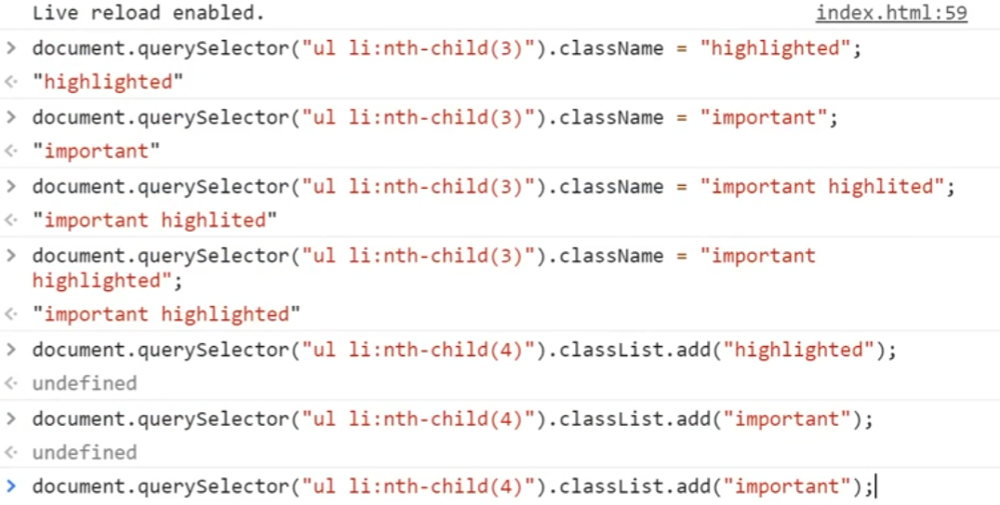


### Last practice

=> Part 04. 나만의 사진 포트폴리오 만들기 참조


#### `toggleLike`함수

```javascript
function toggleLike(idx) {
  if (my_info.like.indexOf(idx) === -1) {// 내가 좋아요하지 않은 사진일 때
      my_info.like.push(idx); 			//my_info의 좋아요에 idx 를 푸쉬해서
      									// 해제 된 상태 유지.
	photos.forEach(function (phto) {     //
        if(photo.idx === idx) {  		//  // → 좋아요로 바꿈
            photo.lieks++;				//
        }
    });

  } else {
		my_info.like = my_info.fillter(function (photo){
        	return photo.idx !== idx; //
    });
    // 내가 좋아요 한 사진일 때
    // → 좋아요 해제

  }

  // 최종적용
  showPhotos();
}
```

---


## Firebase 호스팅

### 웹 호스팅

> 웹 사이트를 배포할 수 있도록 인터넷 망에 연결된 서버의 일정 공간을 임대해주는 서비스

- `호스팅` : 서버 임대 서비스
  - .html`, `.css`, `.js`, 이미지 등 정적 파일들을 업로드하여 외부에서 접근 가능하도록 함

### Firebase

> 서버에 직접 구현해야 했던 기능들을 대신해주는 서비스

- 호스팅,데이터베이스,파일저장,로그인 등


### Firebase 준비

- Node.js 설치

---

## HTML, CSS, JavaScript 심화 학습

main.js 파일을 만들고 본 코드에서 js 파일을 읽어올때는

<script src = ""</script>

형식으로 쓴다.

js 파일은 실행 시 Console 부분에 뜬다.

> `console.log(' 내가 맘대로 입력')`
>
> `콘솔`에 `로그`를 작성한다. 라는 뜻

```
<link rel ="" href="">
```

>외부 문서를 가져와 연결할 때 사용.(대부분 CSS파일)

rel : 가져올 문서와 관계 / href: 가져올 문서의 경로


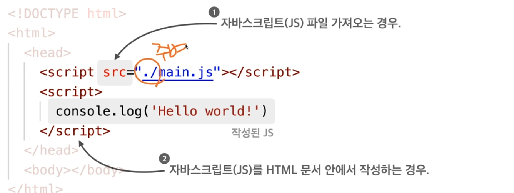


```
 
```

alt : 대체텍스트  ( 이미지가 출력하지 못할 시 알리고자 작성)


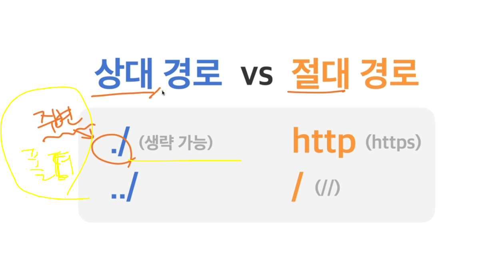

../ (상위폴더로 올라가서 찾음)


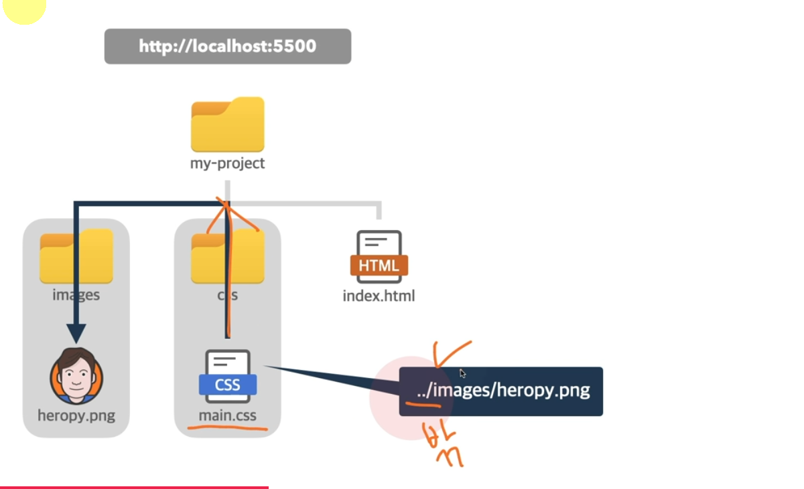

### CSS

>element.style은 css의 인라인 선언 방식으로 스타일이 삽입된다.
>
>console 모드 (개발자도구)
>
>- codepen.io : 온라인에서 코드 작성 가능 사이트.(추천)

선택자P{속성 : 값;}  => color : blue;


### html

> <태그> : 빈태그 -> 뒤에 </태그> 가 없음 -> 빈 태그 뒤에 '/' 를 붙이는 것이 좋다.

ex) meta 태그

> <태그 속성="값">내용</태그>

 <span></span>: 대표적인 인라인 요소!

본질적으로 아무것도 나타내지 않는, 콘텐츠 영역을 설정하는 용도의 태그.

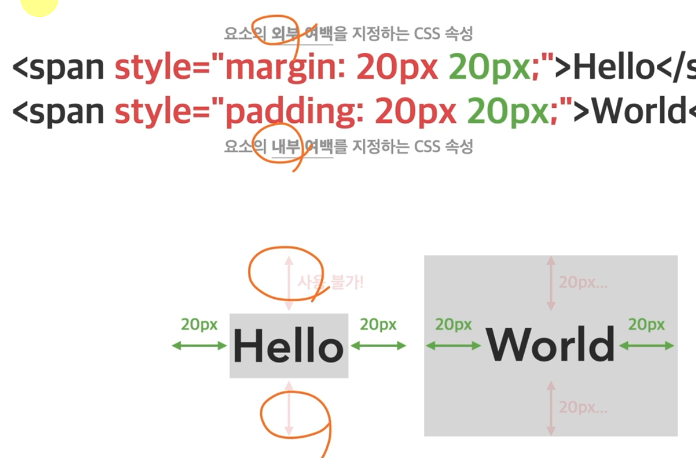

div는 블록요소 span 태그는 인라인요소. 서로 상반됨.

인라인 요소 = 글자 /  블록요소 = 상자 의 개념

```
<a href="링크">클릭될 이름</a> -> 클릭될 이름의 페이지로 이동. 
```

target="_blank" => 새탭에서 연다.

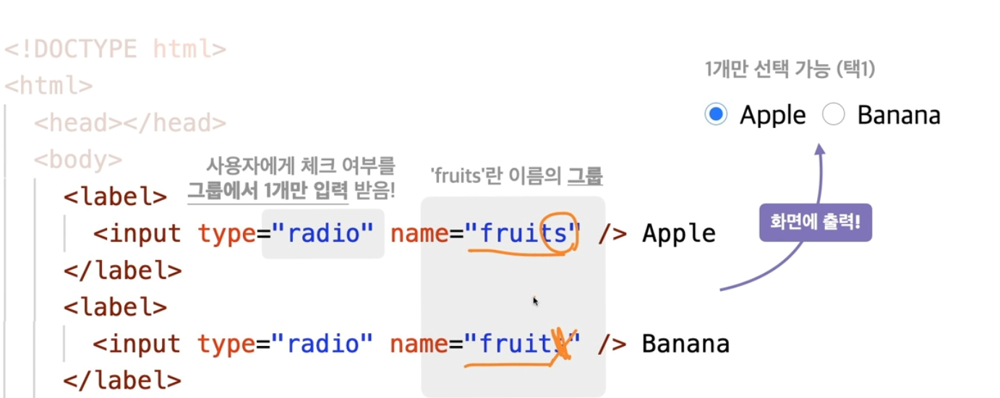

radio 의 역할. 그리고 이름의 그룹은 같은 이릅으로 설정하면 ok가 되는것 이름이 다르면 안된다.

```
<table></table> -> 행과 열의 집합
```

> <태그 id="이름"></태그>

-> Css에서는 "#"id  해주고 설정한다.

script 요소에 defer 속성은, html 구조가 준비된 후(문서 분석 이후)에 JavaScript를 해석하겠다는 의미.

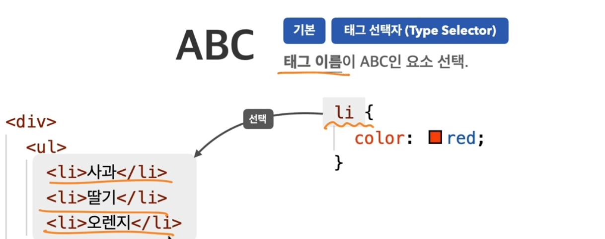


- 복합 선택자

```
<span class="ornage">오렌지</span>
```

span.orange{  color: red;

}

로 선택한다. (= .orange 로 선택 가능)

> ul > .orange {} : 클래스가 orange인 것을 찾는다. 단, ul의 자식요소여야 한다.
>
> (기호는 '>')


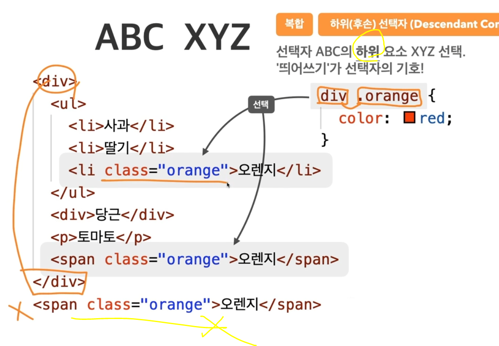

.orange + li => .orange를 선택된 후 그 아래 형제를 출력

.orange ~li => .orange를 선택된 후 그 아래 형제'들' 모두 출력.


a:hover {color:red;} :  해당요소에 마우스커서를 올려두면 색깔을 빨강으로 바꾸겟다.

```
<a href = "링크">이름</a>
```


> inherit -> 상속

.parent -> .child : 부모의 속성을 자식이 상속 가능.

같은 클래스로 선언했을경우 나중에 작성된 색깔로 표시된다.

!important 사용 시 색깔을 강제로 바꿀 수 있지만 사용하지 않는것을 추천한다.

*{}:전체 선택자 	0점

div{}:태그선택자	1점

.hello{}: 클래스선택자	10점

#hello{}:아이디 선택자	100점


- `width, heigh`

  값을 따로 넣지 않아도 `auto`:브라우저가 너비를 계산한다.

인라인 요소는 가로,세로 를 조절할 수 없다. (글자만 정의)

width : 요소의 가로 너비

height: 요소의 세로 너비      둘다 기본 속성은 `auto`이다.

- `단위`
  - vw : viewport의 가로


margin : 상,하,좌,우 모두 적용이 된다(외부)

상,좌/우,하 순서로 작성가능. or 상,우,하,좌 순서로 작성가능.(시계방향으로)

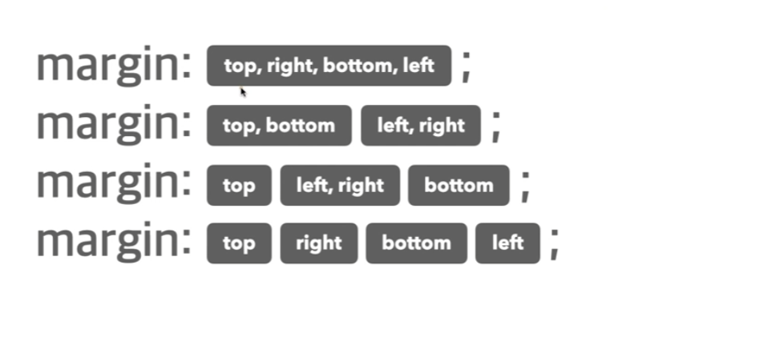

- padding : 요소의 내부여백(공간)을 지정하는 단축 속성.

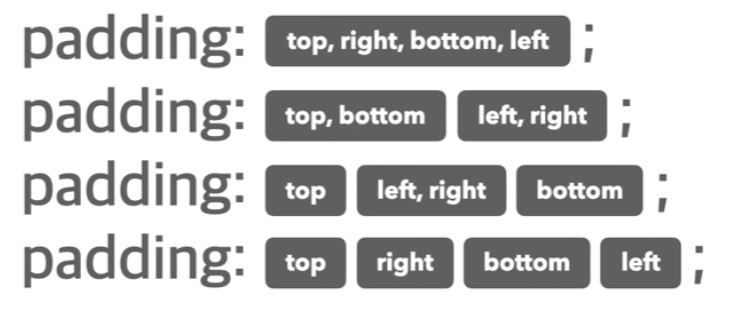

  

- 넘침 제어
  - overflow: hidden;  => 부모보다 자식의 크기가 클경우 맞춰주는것
  - overflow: scroll; => 스크롤 좌우, 위아래로 움직일 수 있는게 생긴다.

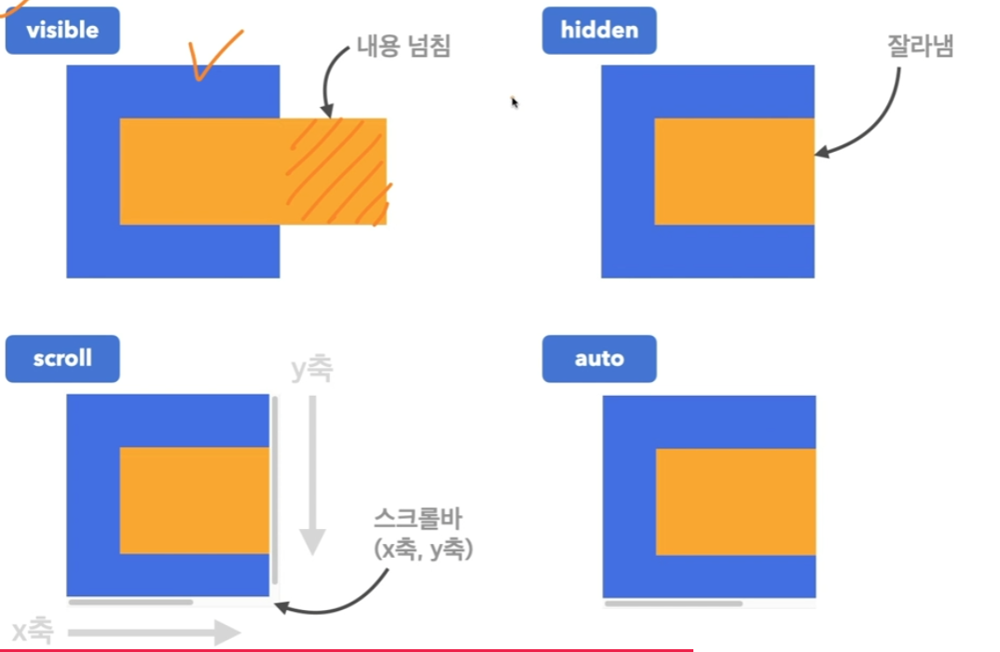

넘치는게 없으면 auto 사용시 넘치는 부분에 해당해서 scroll 바가 생김.

투명도 조절 명령어  = opacity

배경화면 사이즈 조절 = background-size

배경화면 반복 조절 = background-repeat : no-repeat;

배경화면 위치 조절 = background-position: center;

repeat-x / repeat-y = x축 반복 출력 , y 축 반복 출력

화면 스크롤에 따라 이미지 위치가 상하로 이동한다 = background-attachment: scroll; 

패럴렉스 예제 만들기 ( css ) = 위 배경화면 관련 명령어들을 이용하여 홈페이지 배경은 고정/ 요소는 이동.


#### 배치 

`position` : 요소의 위치 지정 기준 설정 ( 음수 사용 가능)

1.relative : 요소자신을 기준

2. absolute : 위치 상 부모 요소를 기준
3. fixed 뷰포트(브라우저)를 기준

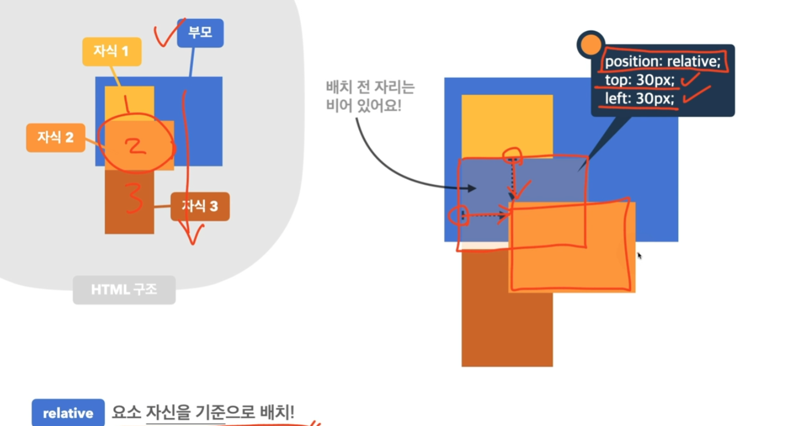

relative 사용 시 그 자리는 시각적으로는 비어 있지만, 실제로는 존재함.

위치가 이동한 것은 '허상'

`position: static; ` : 기준이 되는 부모요소가 2개일 경우 한 곳에 지정하면 다른 부모의 relative를 설정해서 그										걸 기준으로 위치를 설정한다.

z-index : 1; => 요소 쌓임 설정 (가장 먼저 보임)

position 속성의 값으로 absolute, fixed가 지정된 요소는, diisplay 속성이 block으로 변경됨.

display:inline-flex; => 인라인 단위로 끊어져서 flex container을 표현한다.

- container의 주 축을 설정 : flex-direction
- -> row(행 좌->우) 와 row-reverse( 행 우->좌) 

`flex-wrap` : flex는 한줄에 모든 아이템을 표시하려 하는데 그러면 크기가 이상해질 수 있음. 

따라서 , flex-wrap을 이용해 줄바꿈 되게 하여 요소 본연의 크기를 지킴.

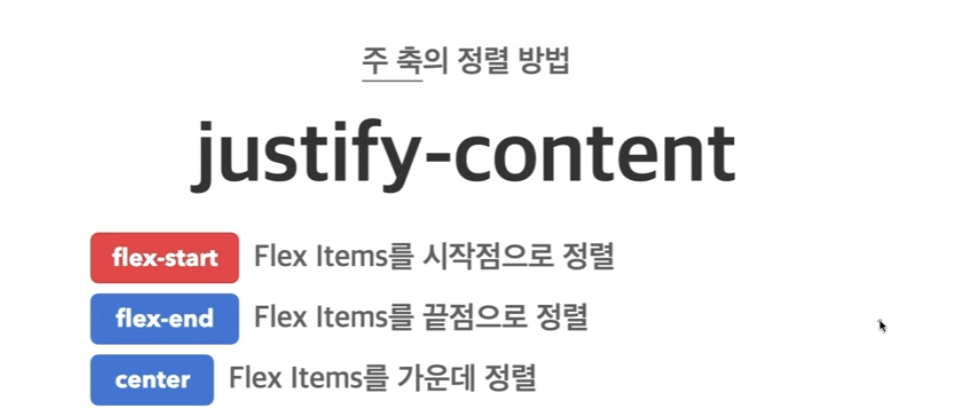


`align-content` : 교차(수직)의 여러 줄 정렬 방법

기타는 위와 같음.(활용도가 높지 않음)

오히려  align-items를 많이 쓴다.

`align-items`:교차 축의 한 줄 정렬 방법

flew-grow : 1; => 1의 비율로 설정된다.

전환 효과 : transition 명령어

변환 효과 : tranform 명령어

1. 변환 

​			trnasform : rotate(45deg); => 45도 만큼 회전을 한다.

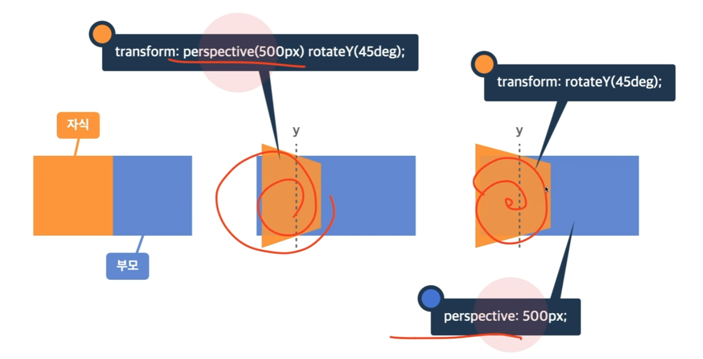

개인적으로 부모요소에 perspective 속성 사용이 선호된다.

차이점 인지할것.


#### JS

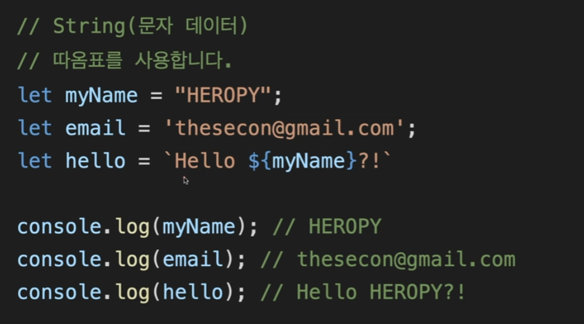


- 객체 데이터 

```
let user = {
name: 'asda',
age: 21,
isvlaid: true
};
closole.log(user.name); // asda  
```

- 배열 데이터

```
let fruits = ['apple'];
console.log(fruits[0]); // 'apple'
```

- 변수

: 데이터를 저장하고 참조하는 데이터 / let 등.

```
let a = 2; //변수 let a 를 선언한다. 그후 2를 대입한다.
let b = 5;

console.log(a+b); // 7
```

- 함수

```//123
//함수 선언
function 원하는이름() {
	//실행코드
	console.log(123);
}

//함수 호출
helloFunc(); // 123
```

```
function returnFunc() {
	return 123;
}
let a = returnFunc();

console.log(a); //123
```

- 매개변수

```
//함수 선언
function sum(a,b){ //a,b는 매개변수
	return a+b;
}
let a = sum(1,2); // 1과 2는 인수

console.log(a); // 3
```

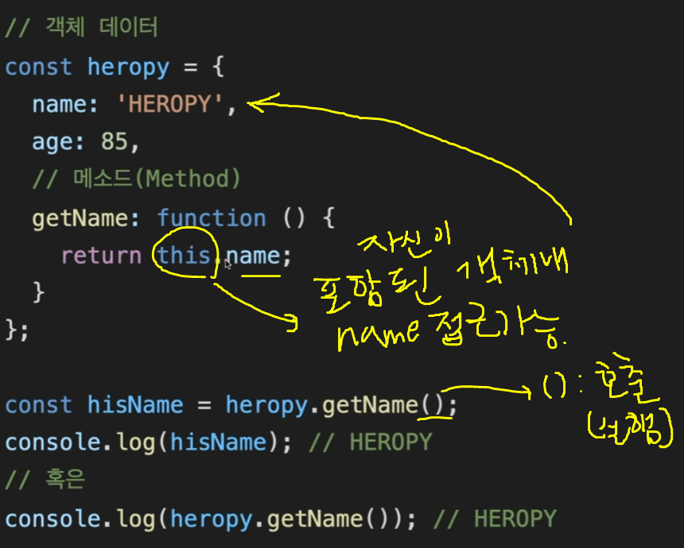

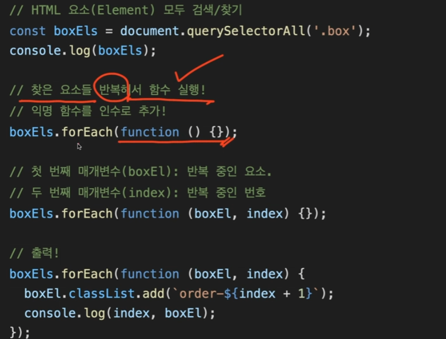

classList 같이 브라우저에서 정의되어 있는것을 `DOM API`라고 한다.

함수 내에서 함수 밖으로 내보낸다. => `return`


