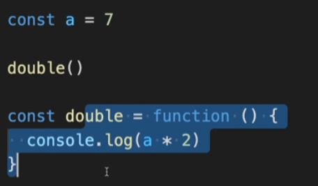
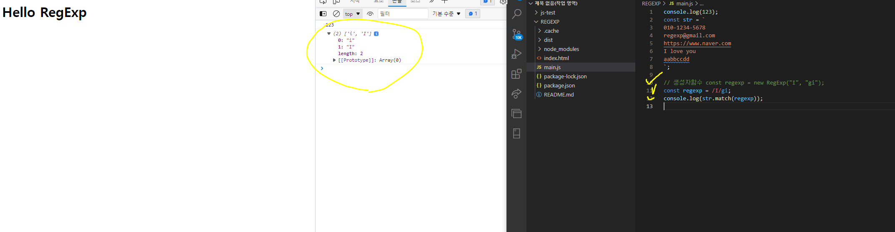

## 홈페이지 만들기


`<header>`는 주로 제목,네비게이션을 포함하고 로고,목차,검색폼을 그룹핑 할 수 있음.

`<nav>` 는 주요 네비게이션을 그룹핑한다.  `<header>` 아래 소제목

`<article>` 는 본문내용 작성

`<section>` 는 영역 내 분리

`<aside>`는 분리된 영역

`<main>`는 article 까지 포함하여 작성해서 가지고있다.


---

### CSS 복습

| font-style            |                     글자 기울기                      |
| --------------------- | :--------------------------------------------------: |
| font-weigh            |                      글자 두께                       |
| font-size             |                      글자 크기                       |
| line-height           |                       줄 높이                        |
| font-family           |                      폰트(서체)                      |
| text-align            |                         정렬                         |
| margin                |   각 list 요소들 상하좌우에 크기 적용(시계방향 순)   |
| margin-bottom         |        요소의 아래에만 크기 적용(시계방향 순)        |
| padding               |           요소의 내부 여백 지정(시계방향)            |
| border-radius         |                    모서리 둥글게                     |
| overflow              | 요소의 크기 이상으로 내용이 넘쳤을 때, 보여짐을 제어 |
| `display`             |              block,inline,inline-block               |
| text-align            |                    문자 정렬 방식                    |
| line-height           |                  한줄의 높이를 설정                  |
| text-indent           |        양수,음수 가능 글자를 밀어쓰는게 가능         |
| background-attachment |       scroll:이미지가 요소를 따라 같이 스크롤        |
|                       |        fixed:이미지가 뷰포트에 고정. 스크롤 x        |
| `dispayl:flex;`       |                      수평 정렬                       |
| flex items            |               자동으로 아이템이 된다.                |
| flex-wrap             |            flex items 묶음(줄 바꿈) 여부             |
| justify-content       |                  주 축의 정렬 방법                   |
| align-content         |             교차 축의 여러 줄 정렬 방법              |
| align-items           |              교차 축의 한 줄 정렬 방법               |
|                       |                                                      |
|                       |                                                      |
|                       |                                                      |
|                       |                                                      |
|                       |                                                      |
|                       |                                                      |
|                       |                                                      |

`display : inline-flex ` :  인라인 요소의 크기만큼 할당되면서 flex가 적용된다.

`flex-direction`: `row`와`row-reverse`가 있다 왼쪽부터정렬 / 오른쪽부터 정렬.

(주축을 설정할때 사용한다.)

세로일 때는 `column`으로 설정한다.

`오픈 그래프`: 웹페이지가 소셜미디어(페이스북 등)로 공유될  때 우선적으로 활용되는 정보를 지정하는것.


`description` 은 간단히 작성한다. 길게 작성할경우 카카오톡에서 악성스크립트로 인식할 수 있음.

 **`SEO`: 검색 엔진 최적화, Search Engine Optimization)**

> 구글이나 네이버 등에 자신의 Web site/Page를 노출할 수 있도록 정보를 최적화 하는 작업을 말한다.


※ 필자는 이 부분에 대해 굉장히 어려움을 겪었고 찾던 부분이였습니다..... ※

※ 모든 Icons , 이미지 등을 매번 디자이너에게 요청하는 것도 쉬운일은 아니다..

※ 따라서, 이런 부분들을 찾아서 적용할 수 있는 부분들을 찾아서 사용하는 것이 좋다.

심지어, 해당 팀에 디자이너가 없을 수 있기 때문에 중요하게 짚고 넘어 가는 것이 좋습니다.

`fonts.google.com`

=>폰트 설정 적용

`google material icons`

=> 아이콘 설정 적용

#### 서브메뉴 만들기

`a 태그` 사용 시 하이퍼링크 속성은 살려두되 기능은 작동하지않게끔하려면

javascript:void(0) 을 삽입해주면 기능작성이 준비되있지않아도 살려둘 수 있다.

### 드롭다운 메뉴 만들기

```
 position: absolute;
  top: 0;
  bottom: 0;
  left: 0;
  margin: auto;
  부모에게 relative 를 주고 
  위치 상 부모 기준으로 가운데 위치한다.
```

`position` 사용시 자동으로 inline 에서 block 으로 바뀐다.

`BEM`

> HTML 클래스 속성의 작명법

요소__일부분 표시

요소--상태

### 전역 배지(GSAP)

> Javescript 부분 참고(코드)

이미지에 글씨가 포함되 있으면 대체텍스트 alt에 명시해주는게 좋다  


### position

굉장히 중요한 부분.

float, flex => flex를 요즘 더 많이 쓰는 추세.  

after 이용하여 clear:both 하여 float 취소시켜주면서 사용하는 방법 숙지.


swiperjs 구글에 검색.

swiperjs 와 관련하여 현재 opacity 부분 promotion 부분에 적용이 안된다.

swiper-slide-active에

## padding-top

padding-top <-- 부모요소의 width 길이를 기준으로 %하여 세로 가 계산된다 항상.

중요한 부분!!!!

`youtube iframe api`

:사이트에서 유튜브 영상 삽입하여 보여줄 수 있는 방법.


> 랜덤한 숫자를 생성하는 함수

// 범위 랜덤 함수 ( 소수점 2자리 까지)

```
function random(min , max){
// `.toFixed()`를 통해 반환된 문자 데이터를,
// `parseFloat()`을 통해 소수점을 가지는 숫자 데이터로 변환
  return parseFloat((Math.random() * (max - min) + min).toFixed(2))
}
```


※모든 내용은 프로젝트 코드를 참조하시오.

## 논외 

Figma 툴 사용을 높이자.


## Markdown 

`README.md`  

새폴더 만들기 -> vscode에서 폴더 선택해서 열기 -> 파일생성하기(README.md) 


## Node.js 

##### 개요 및 설치  

Chrome V8 JavaScript 엔진으로 빌드된 javaScript 런타임

:프로그래밍 언어가 동작하는 환경 (런타임)

- nodejs.org 검색을 통해 이동. 
- LTS(장기적으로 안정되고 신뢰도가 높은 버전 제품화 과정에 용이)를 다운받는다.


##### NVM 사용법 

---

nvm ls

nvm install 버전 입력

nvm use 버전입력

node --version 확인

`nvm 변경할때는` 

nvm use  버전입력

nvm 지우기 : nvm uninstall 버전입력

----

#### NVM 개요 (1)

npm(node package manager)

: 전 세계의 개발자들이 만든 다양한 기능들을 관리.

**npm install XXX 를 통해 우리가 설치해서 사용할 수 있다.**

 npm init -y

package.json 파일이 생성됨 ( 패키지 관리하기 위해)

npm install parcel-bundelr -D : parcel-bundler 를 설치한다

npm install lodash

한번 설치한 패키지는 package.json에 남게되고 다시 설치를 진행할 경우)npm install) 설치된다.

package-lock.json 이라는게 생긴다. => 자동으로 관리되는 파일.

package.json => 직접적으로 관리하는 파일.

위 두개는 절대 지워지면 안된다.

-D 를 붙이는경우 실제 웹사이트에서 사용되지 않는 개발에 사용할떄만(개발용) 의존하는 용도

일반 의존성 설치는 붙이지않는다.

package.json => scripts 부분에 "dev":"parcel index.html"을 해준다.

html 실행 시 서버를 실행하는 부분!!!!!!

"build": "parcel build index.html" +>결과를 보이겠다!!!

parcel-bundler를 설치했기 때문에 위 구문을 적용하면 우리 프로젝트 내에서만 구동되는 서버를 실행시켜준다.

로컬에서 개발서버를 열겠다!! 라는 의미.

그다음 => npm run dev 를 하면

홈페이지 주소가 나오고 우리가 작성한 main.js 부분이 출력된다 (console)

ctrl + c : 서버 종료

.gitignore 파일을 만든다 (  git에서 무시할 파일설정)

.cache/ dist/ node_modules/ 등

`위의 과정들을 하는 이유`

실제 개발에서는 open with liveserver 를 하지 않고

로컬 서버를 열어서 개발을 하기 때문이다.

숙지할것.


## ECMA 스크립트

ES라고도 부른다.

(EX6 ES2015 등)


### 정을수 강사님 수업 (JavaScript)

https://pythontutor.com/

찾아보기


js 는 모든 코드를 객체화해서 관리한다 !! 의 느낌.

프론트엔드 개발 기술면접 질문

블랙스코프 const let 등

호이스팅 . http  런타임 객체지향 프로토타입 등

>  js,css,html 에 대해 상세히 공부를 하자 이론에 대해서...

블랙스코프 안에있는 함수는 왜 호이스팅이 안되는지!!? => 조사할것


브라우저 렌더링 , http , 자바스크립트 동작원리 랑 핵심개념

-> 콜 스택, 이벤트 루프 , 스코프 , 실행 컨텍스트 , 프로토타입

협업(팀프로젝트)과 관련하여
 \- 협업 과정에서 타협이 필요한 상황이 있었는지,

 \- 프로젝트 진행 시, 개발부터 배포까지의 프로세스 설명
 \- 다른 직군(기획, 설계, 백엔드 개발자 등)과의 커뮤니케이션 경험

적성 및 인성 관련하여
 \- 왜 프론트엔드 개발자 하고싶냐
 \- 성취감을 느꼈던 경험
 \- 입사 후 자기개발에 대한 포부 (앞으로의 커리어 관리)
 \- 평소 어떻게 공부했느냐
 \- 요즘 흥미가 있는 기술, framework
 \- 회사에 기여할 수 있다고 자부할 수 있다고 느끼는 자신만의 특별한 무기
 \- 클린코드에 대한 자신의 생각
 \- 읽었던 개발 관련 서적 관련
 \- 회사에서 강제로 업무를 변경(프론트엔드 -> 기획자)을 요청 할 경우 어떻게 할 것인가

리액트 공부할것. 중심으로!

코딩테스트와 실제 적용된 기술  스택을 많이 본다.

---

typeof : 데이터의 타입을 알아내서 출력한다.

import 파일명 from './파일앞의이름만' -> Js에 해당

js끼리 연결할 수 있다. <==핵심

### 비교 연산자 

`===`  : ex) console.log(a===b) 

서로 다르면 false 같으면 true


`!==`: ex) console.log(a!==b) 

서로 다르면 true 같으면 false

`&&` : 둘다 true면 true 하나라도 다르면 fasle

`||` : 하나라도 true 면 true 

### 

## JS의 기본


- 데이터 타입

- 산술 연산자

- 변수 var, let , const의 유효 범위

  - var 같은 경우 함수 내부이외로 let, const 와 다르게 쓰일 수 있고 메모리를 잡아먹을 수 있기

    에 되도록이면 let, const 를 사용하는 것이 좋다.


#### 함수 


```
function sum(x,y) { -> sum(x,y): 매개변수
console.log(x+y)
}
sum (1, 3) // 4 -> 인수
```


#### 즉시실행함수

```
const a= 7;

(function() {
 console.log("a * 2")
}());
//
function double() {
 console.log("a * 2")
}
double(); // 두개가 같은 내용.
```

-> 함수를 생성하자마자 바로 실행이 가능하다.


### 호이스팅 ★★★

- 함수 선언부가 유효범위 최상단으로 끌어올려지는 현상



Javascript 는 위에서부터 아래로 순서대로 실행이 되기 때문에 위 코드는 오류가 난다.


이 코드는 실행이 가능하게 되어진다. 함수 선언부가 아래에 선언되어 있지만 

실제로 브라우저가 동작할때 자바스크립트 엔진에서는 가장 최상부로 올라가서 만들어지게 되므로 호출이 가능해지게 된다.

호출하는 부분보다 함수가 아래에 선언되어 져도 실행이 가능한 원리이다.


#### 타이머 함수

1.setTimeout(함수, 시간) : 일정 시간 후 함수 실행

2.setInterval(함수, 시간) : 시간 간격마다 함수 실행

3.clearTimeout(); 설정된 Timeout 함수를 종료

4.clearInterval(): 설정된 Interval 함수를 종료

```
setTimeout(functuin () {}, ㅖ
	console.log('내용')
},3000)  // ms단위(3초) 3초 뒤 실행.


```

1,3 / 2,4 번 짝궁.


#### 콜백

함수의 인수로 사용되는 함수

setTimeout(함수, 시간) -> 여기서 인수로 함수가 사용 됐다. 이것을 '콜백'이라 한다.

함수를 호출할때 인수로 사용되는 새로운 함수 => 콜백 함수


#### 생성자 함수

prototype

`new 함수명` : 생성자함수

비교하기위해 `function 첫글자대문자`를 쓴다.

ex) function User , new User


#### this

일반 함수는 `호출 위치` 에서,

화살표(Arrow) 함수는 자신이 선언된 `함수 범위`에서 정의

```
const timer = {
name: 'heropy!!',
timeout: function () {
	setTimeout(function () {
		console.log(this.name) // undefined 가 일어난다.
	}, 2000)
}
}
timer.timeout()

setTimeout( () => {} ) 
```

undefined 가 일어난다. : 이유는 setTimeout 이라는 내부로직으로 콜백이되서 실행이 되기 때문에

따라서, function() 부분을 화살표 함수로 바꿔주면 setTimeout을 감싸고있는 timeout 함수가 있기 떄문에 timeout의 function은 timer를 가리키기 때문에 출력이 된다.


## 2021/12/13

### ES6 Classes

생성자 함수의 `prototype`

JS는 prototype 기반의 언어.

```
class User {
	constructor[: function ](first, last) { // [: function ] 이 부분이 생략됨.
		this.firstName = first
		this.lastName = last
	}
	getFullName() {
	
	} // prototype을 따로 쓰지 않아도 그 형식에 맞는 것을 정의한다.
}
React 에서 가장 많이 쓰는 구조.
```


Car 클래스는 license 를 추가하여 `확장`

super 가 Vehicle을 대체하여 상속받아 사용할 수 있게 한다.

음... Vehicle에 정의된 것을 다시 작성하지않고 super를 통해 사용할 수 있다.


### JS 데이터

#### 문자

String : "" , '', ``

Number

Boolean: true, false

undefined

null

Array: []

Object


String mdn : 구글 검색 ㄱㄱ

String : 전역객체 / 문자영의 생성자.

따옴표를 사용하여 만드는 방식 => 리터럴 방식이라 한다.

**Api 가져오는 방법 공부하기.** 

**Youtube iframe Api 정의하는 부분.**


**`trim()`  : 웹사이트 제작시 많이 쓰인다.**

로그인 할때 띄어쓰기 하고 입력할경우 인식오류가 날수 있다 따라서. 그럴때 쓰는 trim() 이라는 메소드가이다


자주 사용할 만한 숫자와 수학  관련 메서드

Math.abs() : 주어진 숫자의 절대값을 반환. ex) -1 => 1

ex ) Math.ceil (3.14) : 올림을 뜻함. 결과 4

​		Math.floor(3.14): 내림을 뜻함. 결과 3

​		Math.round(3.5): 반올림을 뜻함. 겨로가 4

​		Math.random(): 랜덤한 숫자를 표시 


### 배열

`.concat`

ex ) console.log(배열.concat(배열))  : 배열을 합쳐서 출력한다. 원본의 배열 데이터는 수정되지 않는다.

`forEach` :


`map` :


화살표함수 ★

const a = fruits.map(  (fruit, index) => ( { id: index , name: fruit} )    )

형식으로 쓸수있음

 fruit와 index 두개이므로 소괄호 제거 x

한개일때는 const a = fruits.map( fruit => { return number < 3} )요런 형식 가능


### 즉시실행함수 IIFE

함수를 만들자마자 바로 실행할 수 있게한다.

```
(function() {
	console.log("예제")
})();
```


`.filter`  :

필터링 된 결과만 반환

```
const numbers = [1,2,3,4]

const b = numbers. filter(number => {
return number < 3
})
console.log(b) // 결과 [1,2]
console.log(numbers) // 결과 [1,2,3,4]
```


`.find() , .findIndex()` :


`.includes()` : 포함이 되어있는지 확인

포함되있으면 true ,  없으면 false


`.push() .unshift()` : 


`.splice()` :


---

### Object(객체)


> 
>
> 불변성 :


=> **서로  다른 메모리 주소를 바라보는 것이기 때문에.**


`Object.keys` :


---

#### 구조 분해 할당


Banana 만 출력하고 싶으면 Apple 부분은 비워두고 '  ,  ' 를 사용한다. 구조 분해 할당은

순서대로 출력하기 때문이다.


---

`전개연산자`


원래는 아래처럼 사용해야한다.


이걸 쉽게 해주는 것이 전개연산자.


Orange 를 받아줄 수 없기 때문에 위 그림과 같이 사용할 수 있다.


> {a,  b , c} <-- 이부분 객체데이터를 사용할때 중괄호 사용하는데 화살표함수에서 중괄호는 함수의 범위를 나타내는 단순한 블럭으로 사용하는데 객체데이터를 화살표함수 내에서 축약형으로 반환하고 싶다면.


이와 같이 소괄호안에 중괄호를 써줘야한다.

---

### 불변성

> 한번 메모리에 만들어지면 1이 있다면 새로 1을 만드는것이 아니라   
>
> 기존의 1이 들어있는 메모리 주소를 가르키게 한다. 

단, 참조형 데이터 : Object, Array, function 은 불변성이 없다.

참조형 데이터 => 내용이 일치해 보이지만 실제로 다른 메모리 주소에 각각 들어있기 때문에

비교연산자를 사용하여 비교해도 false가 반환된다.

이를 해결하기위해  얕은 복사와 깊은 복사를 사용.

#### 얕은 복사 깊은 복사


이렇게 할 경우 user 의 age를 수정해도 copyUser 부분도 수정된다. 이를 복사를 통해 해결가능.


이렇게 해결 가능.

**또한, `전개 연산자` 로 해결도 가능하다.**


---

**깊은 복사**

깊은 복사는 javescript 로 구현하기 복잡해서.

```
lodash 패키지를 설치해서 구현.

npm install lodash ( 터미널에서 실행한다 
```

main.js 상단에  `import _ from 'lodash'` 를 통해 가져온다.

그 후 user 아래

const copyuser = _.cloneDeep(user) 를 해준다.


얕은 복사를 했을때 age는 변했지만 emails에 push를 했지만 copyUser 부분의 emails도 변경된다

이유는, user는 복사해서 따로 했지만 그 안의 emails 는 복사한게 아니다. 따라서, 깊은복사로 하여 해결해 준다.

깊은 복사는 겉의 껍데기 뿐만아니라 그 안의 내용까지 복사하는 것.

---

export default 는 딱 한번만 가능하고

export 이름 같은 경우에는 여러개 작성이 가능하다.


`lodash` 사용법


lodash를 통해서 다양한 코드를 작성할 수 있다. 매우 편리하게

uniaBy, unionBy , find, findindex 까지 가장 많이 쓰이기에 관심가지면 좋다.


## JSON

server 와의 통신을 위해 주로 사용.

.json 파일은 하나의 문자 데이터이다.

(import myData from './myData.json')으로 js 상단에 선언하여 가능


### Storage

`localStorage.setItem('myCat', ' Tom');`

-> 현재 도메인의 로컬 Storage 객체에 접근한 후, Storage.setitem()을 사용해 항목 하나를 추가

Json 문자데이터를 자바스크립트 엔진 형식으로 변경해주는 로직에 대해 이해.


### axios

axios 패키지를 통해 api를 사용할 수 있다.

->npm install axios

-> import axios frome 'axios'

```
function 함수명() {
axios.get('주소')
.then((response) => { //get한 것은 받아서 처리하는 것.
	console.log(response)
})
}
함수명()
```


### 정규표현식

바탕화면 폴더만들기 /

 vscode에서 열기 /

npm init -y 해서 package.json 파일 생성/

npm install parcel-bundler -D/

index.html 파일만들기/

main.js 파일 만들기/

```
<script src = ./main.js> <-- 설정하기
```

개발서버가 열릴 수 있게 설정하기.

```
package.json 에서 "scripts": 부분에
"dev" : "parcel index.html",
"build" : "parcel build index.html" 
```


> 문자열을 검색하고 대체하는 데 사용 가능한 일종의 형식 언어.
>
> 간단한 문자 검색부터 이메일, 패스워드 검사 등의 복잡한 문자 일치 기능 등을 
>
> 정규식 패턴으로 빠르게 수행할 수 있다.

https://regexr.com  :  정규식 테스트 사이트.

```
리터럴 방식
const regexp1 = /^abc/; // abc로 시작하는 것은 찾는다
```

//리터럴 방식

/표현/옵션

/[a-z]/gi

gi : 모든 내용을 찾겠다(g) 와 대소문자 가리지않겠다(i)




## 메소드

메소드 | 문법 | 설명
--|--|--
text | `정규식.text(문자열)` | 일치 여부(Boolean) 반환
match | `문자열.match(정규식)`| 일치하는 문자의 배열(Array) 반환
replace | `문자열.replace(정규식, 대체문자)` | 일치하는 문자를 대체

ex) console.log(str.match(/문자열/gi))


## 패턴(표현)

패턴 | 설명
--|--
^ab | 줄(Line) 시작에 있는 ab와 일치
ab& | 줄(Line) 끝에 있는 ab와 일치


## 패턴(표현)

패턴 | 설명
--|--
^ab | 줄(Line) 시작에 있는 ab와 일치
ab& | 줄(Line) 끝에 있는 ab와 일치
. | 임의의 한 문자와 일치
a&verbar;b | a 또는 b와 일치
ab? | b가 없거나 b와 일치
{3} | 3개 연속 일치
{3,} | 3개 이상 연속 일치
{3,5} | 3개 이상 5개 이하 연속 일치
\w | 63개 문자(Word, 대소영문52개 + 숫자 10개 + _)에 일치
\b | 63개 문자에 일치하지 않는 문자 경계
\d | 숫자에 일치
\s | 공백에 일치


예제 :

```
the frozen brown jumps fox
```


```
console.log(
	str.match(/\bf\w{1,}\b/g)
)
```

결과 

> 

=> `f`로 시작하는 것을 찾는다.


## TypeScript 

https://slides.com/woongjae/ts2021 이웅재 강사


**TypeScript 란?**

: 자바스크립트에 '타입' 을 추가해서 확장시킨다.


**TypeScript 설치**


`nvm` 

- https://github.com/coreybutler/nvm-windows

`TypeScript 컴파일러 설치`

- npm i typescript -g 후
  - node_modules/.bin/tsc 가 생긴다.


vscode( 터미널(cmd)에서 `code .` 으로 바로 실행가능)  

새 폴더 생성 - vscode 실행 - 폴더 열기 - 파일명.ts만들기 - `npm init -y` -`npm i typescript -D`    

(-D 는 개발용으로 사용한다는 의미 정의)    

`npx tsc --init` : tsconfig.json 파일 생성.  

 명령어  `npx tsc`  실행하여 tsconfig.json형태로 실행되도록 명령어 입력.  


**[Tip]** ctrl+shift+p 를 통해 해당을 설치해야 터미널에서 `code .` 으로 vscode 열수 있다.


TypeScript 프로그램 작성을 위해  제공되는 타입

`number` :

```
let 이름: number = 1; //ex)
```

`undefined & null`:

**--strictNullChecks** 를 사용한다 기본적이로.

Why? => number에 null을 쓸 경우 오류가 나기 때문에 이를 방지하기위해,   

undefined와 null 즉, 자신에게만 사용 가능하도록 하는 것이다.


`never`

never 타입은 모든 타입의 subtype 이며, 모든 타입에 할당 할 수 있다.  

하지만, never 에는 그 어떤 것도 할당할 수 없다.


타입 스크립트의 타입 시스템

- 타입을 명시적으로 지정할 수 있다.
- 타입을 명시적으로 지정하지 않으면, 타입스크립트 컴파일러가 자동으로 타입을 **추론**

따라서,

`nolmplicitAny` 옵션

: 옵션을 켜면  타입을 명시적으로 지정하지 않은 경우,  

타입스크립트가 추론 중 `any` 라고 판단하게 되면,  

컴파일 에러를 발생시켜  

명시적으로 지정하도록 유도한다

※ 필자는 이부분에서 에러가 발생하였을때 굉장히 애를 먹었습니다..  

※  작성자와 사용자의 관점에서 각각 바라보는 시각이 다르기 때문에 이점을 신경쓰면 좋겠다 ※  


DOM API

Document Object Model

Html 에 들어있는 div,span,input 요소들을 의미 = DOM

jsonplaceholder => photo

