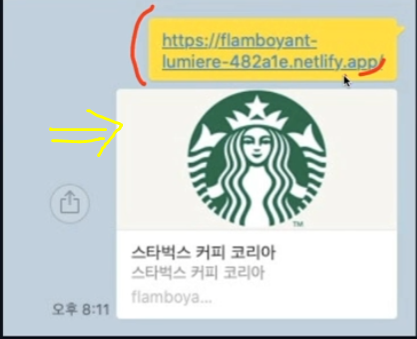
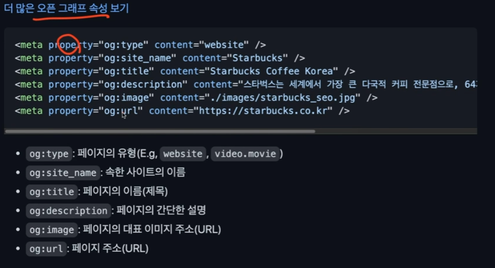
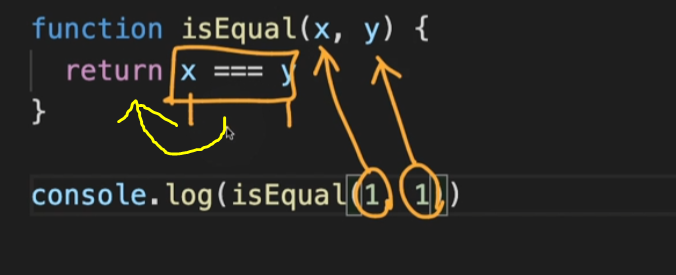

## 홈페이지 만들기


`<header>`는 주로 제목,네비게이션을 포함하고 로고,목차,검색폼을 그룹핑 할 수 있음.

`<nav>` 는 주요 네비게이션을 그룹핑한다.  `<header>` 아래 소제목

`<article>` 는 본문내용 작성

`<section>` 는 영역 내 분리

`<aside>`는 분리된 영역

`<main>`는 article 까지 포함하여 작성해서 가지고있다.


---

### CSS 복습

| font-style            |                     글자 기울기                      |
| --------------------- | :--------------------------------------------------: |
| font-weigh            |                      글자 두께                       |
| font-size             |                      글자 크기                       |
| line-height           |                       줄 높이                        |
| font-family           |                      폰트(서체)                      |
| text-align            |                         정렬                         |
| margin                |   각 list 요소들 상하좌우에 크기 적용(시계방향 순)   |
| margin-bottom         |        요소의 아래에만 크기 적용(시계방향 순)        |
| padding               |           요소의 내부 여백 지정(시계방향)            |
| border-radius         |                    모서리 둥글게                     |
| overflow              | 요소의 크기 이상으로 내용이 넘쳤을 때, 보여짐을 제어 |
| `display`             |              block,inline,inline-block               |
| text-align            |                    문자 정렬 방식                    |
| line-height           |                  한줄의 높이를 설정                  |
| text-indent           |        양수,음수 가능 글자를 밀어쓰는게 가능         |
| background-attachment |       scroll:이미지가 요소를 따라 같이 스크롤        |
|                       |        fixed:이미지가 뷰포트에 고정. 스크롤 x        |
| `dispayl:flex;`       |                      수평 정렬                       |
| flex items            |               자동으로 아이템이 된다.                |
| flex-wrap             |            flex items 묶음(줄 바꿈) 여부             |
| justify-content       |                  주 축의 정렬 방법                   |
| align-content         |             교차 축의 여러 줄 정렬 방법              |
| align-items           |              교차 축의 한 줄 정렬 방법               |
|                       |                                                      |
|                       |                                                      |
|                       |                                                      |
|                       |                                                      |
|                       |                                                      |
|                       |                                                      |
|                       |                                                      |

`display : inline-flex ` :  인라인 요소의 크기만큼 할당되면서 flex가 적용된다.

`flex-direction`: `row`와`row-reverse`가 있다 왼쪽부터정렬 / 오른쪽부터 정렬.

(주축을 설정할때 사용한다.)

세로일 때는 `column`으로 설정한다.

`오픈 그래프`: 웹페이지가 소셜미디어(페이스북 등)로 공유될  때 우선적으로 활용되는 정보를 지정하는것.





`description` 은 간단히 작성한다. 길게 작성할경우 카카오톡에서 악성스크립트로 인식할 수 있음.

 **`SEO`: 검색 엔진 최적화, Search Engine Optimization)**

> 구글이나 네이버 등에 자신의 Web site/Page를 노출할 수 있도록 정보를 최적화 하는 작업을 말한다.


※ 필자는 이 부분에 대해 굉장히 어려움을 겪었고 찾던 부분이였습니다..... ※

※ 모든 Icons , 이미지 등을 매번 디자이너에게 요청하는 것도 쉬운일은 아니다..

※ 따라서, 이런 부분들을 찾아서 적용할 수 있는 부분들을 찾아서 사용하는 것이 좋다.

심지어, 해당 팀에 디자이너가 없을 수 있기 때문에 중요하게 짚고 넘어 가는 것이 좋습니다.

`fonts.google.com`

=>폰트 설정 적용

`google material icons`

=> 아이콘 설정 적용

#### 서브메뉴 만들기

`a 태그` 사용 시 하이퍼링크 속성은 살려두되 기능은 작동하지않게끔하려면

javascript:void(0) 을 삽입해주면 기능작성이 준비되있지않아도 살려둘 수 있다.

### 드롭다운 메뉴 만들기

```
 position: absolute;
  top: 0;
  bottom: 0;
  left: 0;
  margin: auto;
  부모에게 relative 를 주고 
  위치 상 부모 기준으로 가운데 위치한다.
```

`position` 사용시 자동으로 inline 에서 block 으로 바뀐다.

`BEM`

> HTML 클래스 속성의 작명법

요소__일부분 표시

요소--상태

### 전역 배지(GSAP)

> Javescript 부분 참고(코드)

이미지에 글씨가 포함되 있으면 대체텍스트 alt에 명시해주는게 좋다  


### position

굉장히 중요한 부분.

float, flex => flex를 요즘 더 많이 쓰는 추세.  

after 이용하여 clear:both 하여 float 취소시켜주면서 사용하는 방법 숙지.


swiperjs 구글에 검색.

swiperjs 와 관련하여 현재 opacity 부분 promotion 부분에 적용이 안된다.

swiper-slide-active에

## padding-top

padding-top <-- 부모요소의 width 길이를 기준으로 %하여 세로 가 계산된다 항상.

중요한 부분!!!!

`youtube iframe api`

:사이트에서 유튜브 영상 삽입하여 보여줄 수 있는 방법.


> 랜덤한 숫자를 생성하는 함수

// 범위 랜덤 함수 ( 소수점 2자리 까지)

```
function random(min , max){
// `.toFixed()`를 통해 반환된 문자 데이터를,
// `parseFloat()`을 통해 소수점을 가지는 숫자 데이터로 변환
  return parseFloat((Math.random() * (max - min) + min).toFixed(2))
}
```


※모든 내용은 프로젝트 코드를 참조하시오.

## 논외 

Figma 툴 사용을 높이자.


## Markdown 

`README.md`  

새폴더 만들기 -> vscode에서 폴더 선택해서 열기 -> 파일생성하기(README.md) 


## Node.js 

##### 개요 및 설치  

Chrome V8 JavaScript 엔진으로 빌드된 javaScript 런타임

:프로그래밍 언어가 동작하는 환경 (런타임)

- nodejs.org 검색을 통해 이동. 
- LTS(장기적으로 안정되고 신뢰도가 높은 버전 제품화 과정에 용이)를 다운받는다.


##### NVM 사용법 

---

nvm ls

nvm install 버전 입력

nvm use 버전입력

node --version 확인

`nvm 변경할때는` 

nvm use  버전입력

nvm 지우기 : nvm uninstall 버전입력

----

#### NVM 개요 (1)

npm(node package manager)

: 전 세계의 개발자들이 만든 다양한 기능들을 관리.

**npm install XXX 를 통해 우리가 설치해서 사용할 수 있다.**

 npm init -y

package.json 파일이 생성됨 ( 패키지 관리하기 위해)

npm install parcel-bundelr -D : parcel-bundler 를 설치한다

npm install lodash

한번 설치한 패키지는 package.json에 남게되고 다시 설치를 진행할 경우)npm install) 설치된다.

package-lock.json 이라는게 생긴다. => 자동으로 관리되는 파일.

package.json => 직접적으로 관리하는 파일.

위 두개는 절대 지워지면 안된다.

-D 를 붙이는경우 실제 웹사이트에서 사용되지 않는 개발에 사용할떄만(개발용) 의존하는 용도

일반 의존성 설치는 붙이지않는다.

package.json => scripts 부분에 "dev":"parcel index.html"을 해준다.

html 실행 시 서버를 실행하는 부분!!!!!!

"build": "parcel build index.html" +>결과를 보이겠다!!!

parcel-bundler를 설치했기 때문에 위 구문을 적용하면 우리 프로젝트 내에서만 구동되는 서버를 실행시켜준다.

로컬에서 개발서버를 열겠다!! 라는 의미.

그다음 => npm run dev 를 하면

홈페이지 주소가 나오고 우리가 작성한 main.js 부분이 출력된다 (console)

ctrl + c : 서버 종료

.gitignore 파일을 만든다 (  git에서 무시할 파일설정)

.cache/ dist/ node_modules/ 등

`위의 과정들을 하는 이유`

실제 개발에서는 open with liveserver 를 하지 않고

로컬 서버를 열어서 개발을 하기 때문이다.

숙지할것.


## ECMA 스크립트

ES라고도 부른다.

(EX6 ES2015 등)


### 정을수 강사님 수업 (JavaScript)

https://pythontutor.com/

찾아보기


js 는 모든 코드를 객체화해서 관리한다 !! 의 느낌.

프론트엔드 개발 기술면접 질문

블랙스코프 const let 등

호이스팅 . http  런타임 객체지향 프로토타입 등

>  js,css,html 에 대해 상세히 공부를 하자 이론에 대해서...

블랙스코프 안에있는 함수는 왜 호이스팅이 안되는지!!? => 조사할것


브라우저 렌저링 , http , 자바스크립트 동작원리 랑 핵심개념

-> 콜 스택, 이벤트 루프 , 스코프 , 실행 컨텍스트 , 프로토타입

협업(팀프로젝트)과 관련하여
 \- 협업 과정에서 타협이 필요한 상황이 있었는지, 어떻게 풀어나갔는지
 \- 프로젝트 중 만난 이슈와 해당 이슈를 해결한 과정
 \- 프로젝트 진행 시, 개발부터 배포까지의 프로세스 설명
 \- 다른 직군(기획, 설계, 백엔드 개발자 등)과의 커뮤니케이션 경험

적성 및 인성 관련하여
 \- 왜 프론트엔드 개발자 하고싶냐
 \- 성취감을 느꼈던 경험
 \- 입사 후 자기개발에 대한 포부 (앞으로의 커리어 관리)
 \- 평소 어떻게 공부했느냐
 \- 요즘 흥미가 있는 기술, framework
 \- 회사에 기여할 수 있다고 자부할 수 있다고 느끼는 자신만의 특별한 무기
 \- 클린코드에 대한 자신의 생각
 \- 읽었던 개발 관련 서적 관련
 \- 회사에서 강제로 업무를 변경(프론트엔드 -> 기획자)을 요청 할 경우 어떻게 할 것인가

리액트 공부할것. 중심으로!

코딩테스트와 실제 적용된 기술  스택을 많이 본다.

---

typeof : 데이터의 타입을 알아내서 출력한다.

import 파일명 from './파일앞의이름만' -> Js에 해당

js끼리 연결할 수 있다. <==핵심

### 비교 연산자 

`===`  : ex) console.log(a===b) 

서로 다르면 false 같으면 true



`!==`: ex) console.log(a!==b) 

서로 다르면 true 같으면 false

`&&` : 둘다 true면 true 하나라도 다르면 fasle

`||` : 하나라도 true 면 true 

### 

## JS의 기본


- 데이터 타입

- 산술 연산자

- 변수 var, let , const의 유효 범위

  - var 같은 경우 함수 내부이외로 let, const 와 다르게 쓰일 수 있고 메모리를 잡아먹을 수 있기

    에 되도록이면 let, const 를 사용하는 것이 좋다.


