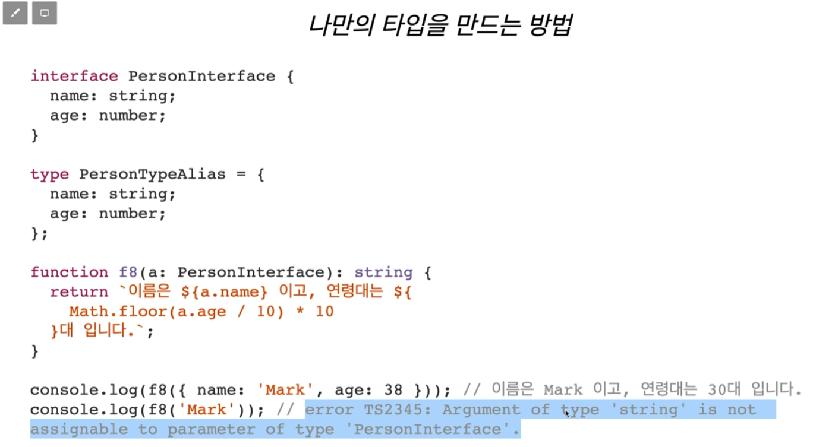
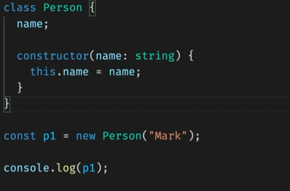
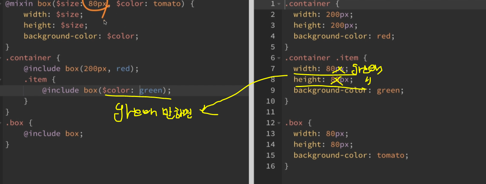
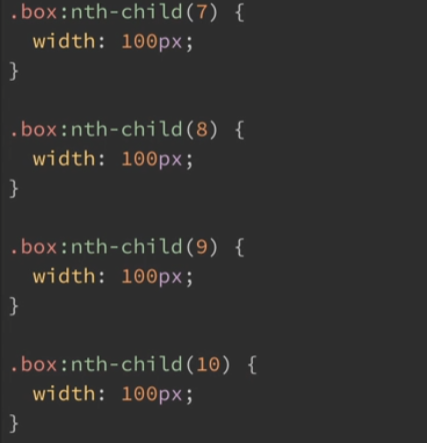
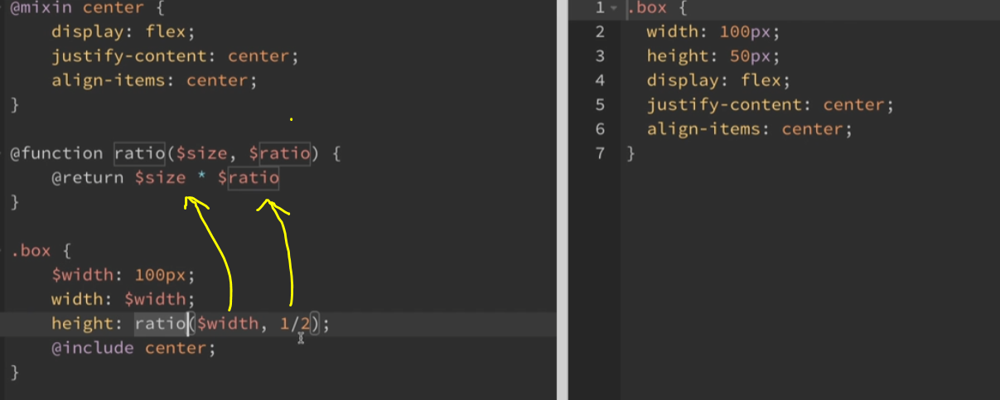
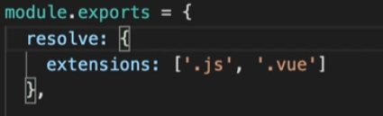
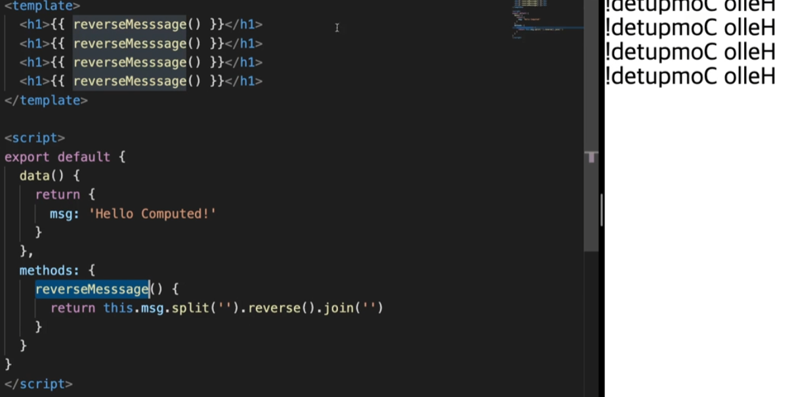

# 4주차 정리

## toyproject

> 진행중 ...


## 강의 정리

TypeScript 이어서 ...




### Aliasing

ex)

```
let person : [string, number ] = [ 'mark'm 35];

type PersonTuple = [string, number];

let another: PersonTuple = ['Anna', 24];
```


$$ TypeScript 순서

폴더 생성 - `npm init -y`->`npm i typescript -D`->`npx tsc --init`


ex) tsconfig.json에서

{

"compileOnSave" : true,

"compilerOptions": {

}

}

: 프로젝트에서 파일을 save하면 컴파일하겠다.

---

`extends` :

npm install --save-dev @tsconfig/deno

->

{

"extends" : "@tsconfig/deno/tsconfig.json"

}


---

files, include, exclude

- 셋다 설정이 없으면 ,전부다 컴파일
- files
  - 상대 혹은 절대 경로의 리스트 배열이다.
  - exclude 보다 쎼다.

- include, exclude

  - glob 패턴 (마치 .gitignore)

  - include

  - exclude 보다 약하다.

    *같은걸 사용하면 .tx/ .tsx/ .d.ts 만 include(allowJS)`

`<outDir>`은 include에 있어도 항상 제외한다.

---

`compileOptions` 

: 외부라이브러리를 사용하는경우 typeing이 안되어있기떄문에 쓴다??

- typeRoots
- types


항상 `strict`를 true 로 설정해서 사용하는게 중요.

: type checking 옵션을 킨다.

---

### interface ex)

```
#interface 사용전 !!#


function hello1(person: {name: string; age:number}):void {

console.log(`안녕하세요!${person.name}입니다.` )

}

const p1:  = {

name:"Mark,

age:39,

}

hello1(p1);
ㅡㅡㅡㅡㅡㅡㅡㅡㅡㅡㅡㅡㅡㅡㅡㅡㅡㅡㅡㅡㅡㅡㅡㅡㅡㅡㅡㅡㅡㅡㅡㅡㅡㅡㅡㅡㅡ
#interface 사용후#
interface Person1 {
name:string;
age:number;
} // 인터페이스부분은 컴파일 시 사라지게된다. -> js에 표시되지않음.

function hello1(person: Person1):void {
console.log(`안녕하세요!${person.name}입니다.` )
}

const p1: Person1  = {
name:"Mark,
age:39,
}
hello1(p1);

age는 있을수도 없을수도 있는 형태라면
`age?` 로 표기한다.
```

arrow 함수 내에서는 `this`를 사용할 수 없다!

implements를 이용해 인터페이스의 내용을 바탕으로  class를  만들어낸다.

ex) class Person implements IPerson1 {}


**상속**

```
interface IPerson2 {
	name: string;
	age?:number;
}

interface IKorean extends IPerson2 {
	city: string;
}
const k: IKOrean = {
	name: " 나",
	city: "서울",
}
//
프로젝트할때 상속관계로 interface를 표현하는 경우가 많고 편하다.

```


**Function interface**

```
interface HelloPerson {
	(name: string, age?: number): void;
}
const helloPerson: HelloPerson = funtion(name:string, age:number){
console.log(`안녕하세요!${name}입니다.`);
};
helloPerson("Mark", 39);
//에러발생 age:number 부분
//이유는, 실제 구현체는 항상 있는걸로만 표현되있기 때문에 Error가 발생.
따라서, age,number를 지우고 아래처럼 쓰면 정상작동.
```


### type alias vs interface

//type alias

type 함수이름 = ( food: string) = > void;

//interface

interface IEat {

​	(food: string): void;

}


//type alias

type PersonList = string[];

//interface

interface IPersonList {

[index:number] : string; // [0] : 이름;

}


## Class

클래스의 처음은 대문자로 시작 ex) class Person {}




JS로 컴파일되면 es5의 경우 function으로 변경된다

```
var Person = (function() {
	function Person() {
	
	}
	return Person;
}());
var p1 = new Person();
console.log(p1);
```


class => object

싱글톤 패턴

클래스로부터 단하나의 객체만 만들어서 사용.


```
class ClassName {
private static instance: ClassName | null = null;
public static getInstanc() {
//ClassName 으로부터 만든 object가 있으면 그걸리턴
// 없으면, 만들어서 리턴
	if(ClassName === null) {
		ClassName.instance = new ClassName();
	}
	return ClassName.instance;
}
private constructor () {}
}
const a = ClassName.getInstanc();
const b = ClassName.getInstanc();
```

 

abstract : 

★abstract는 완벽하지않기떄문에 new로 뭘할수없다 = > 오류뜬다.

★abstract로 구현한 함수를 꼭 구현해줘야한다.

상속을 통해 가능.

```
//기본형식
abstract class 이름 { 
abstract 함수()
}
```


Geneucsm Any와 다른점.

Any는 모든걸받아서 모든걸 주는 것. <->  

제네릭은 각자에 맞게 주어준다.

```
제네릭함수명<타입(인수: 타입): 리턴타입{
 	return 인수
}
```

T 부분 -> <T, U> 등 여러개가 들어갈 수 있다.

---

**Json**

"Json은 Map구조이다."

: Key와 value가 쌍으로 저장되는데, key값이 중복되면안된다.  

(즉, 마지막 값만 저장된다.)


## SCSS



반복문 

```
@for $i from 1 through 10 { // for(let i=0; i<10; i += 1)
	.box:nth-child(#{$i}) {
		width: 100px 	
	}
} //아래결과
```



---

**SCSS함수**





색상 내장 함수

saturate($color, 40%) // 채도

lighten // 명도

darken // 어둡게

invert // 색상을 반전

mix // 두개의 색상을 섞음

rgba($color, .5) // 투명도


**가져오기**

 main.scss / sub1.scss /sub2.scsss 총 3개의 파일을 만들었을 때  

main.scss 에서 `@import "./sub1", "./sub2"`로 하여 각 scss의 설정을 가져올 수 있다.


**리팩토링**

: 결과의 변경 없이 코드의 구조를 재조정한다.  

Css의 파일을 Scss의 형식으로 재구성해보았다.  


**반복문@each**

`@each $c in $list {1,2,3}`

:list안의 것들을 c라는곳에 반복해서 하나씩 넣어준다.

`@each $key, $value in $map {1,2,3}`

: key와 value 형태로 사용할 수 있다.

부트스트랩 part에서 기본적으로 알고있어야 사용이가능하지만,, 중요한 부분은 아니다.


https://www.curioustore.com/#!/ 변수명 추천 사이트


---

뷰 - 중국의 디자이너가 만듬

구글이 만든거 - 앵귤러

페이스북이 만든 거 - 리액트

둘다 프레임워크이다

이후 이들보다 좀더 쉬운 형태의 작업방식을 디자인하여 학습시간을 줄일 수 있는

vue.js가 등장함

뷰는 앱작업이 약함 하지만, 플러터가 나왔기때문에 이부분 학습도 굿


웹컴포넌트 ??(아직은 이르다)

Chrome - Vue.js devtools를 검색해서 설치

vscode에서 vetur, vue vscode snipperts 2개를 깐다.

`npm i -g @vue/cli` :  프로젝트를 위한 설정/설치를 쉽게 하기 위해 Vue CLi를 제공.

-g 옵션은 전역에 설치하라는 옵션

패키지 매니저인 npm을 통해서는 전역과 지역으로 범위를 구분해서 설치하도록 되어있다.

설치후 버전을 확인하는 명령 -> `vue --version`


`cd first_vue` ->`npm urn serve` 이동한후에 first_vue 프로젝트를 개발 진행용으로 진행

npm run build <= dist라는 폴더를 만든다 --> 이걸 Netlify(호스팅 해주는거)에 올리면 배포.


## bootstrap

bootstrap을 통해 할 수 있는 것들.  

class 이름만으로도 버튼 생성이 가능.


**01.CDN 프로젝트 생성**

- 트리 쉐이킹(Tree Shaking)이란 단일 번들을 최적화할 때 사용되는..필요하지 않은 코드를 제거하는 기술.

bootstrap 설치 및 연결

bootstrap 사이트 - get started 클릭 - CSS, JS  link 복붙 및 Bundle(묶음이라는 뜻) 및 Separate  에서  script 복붙

popper.js => 팝업창을 원하는곳에 간단하게 만들어주는 것.(사이트 있음)

사이트에서 사이드바-> Components 로 이동 -> Dropdown 클릭 후 코드 복사후 넣기.(실습해보기)


**양식**

`Forms `

(이메일 및 패스워드) 입력 폼들의 소스코드가 있음.


**NPM 프로젝트 생성**

1.npm init -y => packge.json 파일 생성

2.npm i parcel-bundler -D 

3.scripts 부분 -> "dev": " parcel index.html"

​							"build": "parcel build index.html" 해주기

4.bootstrap 사이트로 이동 -> npm install bootstrap@next 설치

5.main.js 파일 생성 - import bootstrap from 'bootstrap/dist/js/bootstrap.bundle'  

6.scss 폴더생성 -> main.scss 파일 생성 -> @import "../node_modules/bootstrap/scss/bootstrap.scss" 해주기

7.scss와 달리 js는 node_modules에 바로 접근이 가능하다. (CDN 방식과 반대)

장점.

bootstrap에서 필요한 부분들만 가져와 사용할 수 있으며, 커스터마이징이 가능하다.


**테마 색상 커스터마이징**

bootstrap 사이트 사이드바에 Customize 로 이동하여 참고.


**성능 최적화(트리 쉐이킹**

Optimize

가져오고 싶은 것들만 가져오기


## Bundler

scss , react 등 을 Bundler 를 통해 변환을 해주는 것.

html,css,javascript 로만 코딩을 하기에는 비효율적인 면들이 존재한다.

따라서, 다양한 기능을 가진 패키지들을 통해서 개발을 진행하고 번들러를 통해 변환을 진행한다.

`parcel-Bundler` : 중/소형 프로젝트에 적합.

`Webpack`: 중/대형 프로젝트에 적합.


#### 정적파일연결

Online ICO converter 사이트를 통해 파비콘 파일생성 가능.

parcel plugin static files copy 사이트를 통해 자동으로 번들러를 통해 dist로 붙여넣기 해주는 옵션을 설정한다

-> npm i parcel plugin static files copy 터미널 실행

package.json 에 "staticFiles" : {"staticPath": "static"} 해준다.

static 폴더 만들고 favicon.ico 파일을 넣어준다


#### autoperfixer 

> **npm i -D postcss autoprefixer 설치**

Vender 사의 접두사를 자동으로 붙여주는 것

이 후, 

```
"browserslist" : [
">1%"//전세계의 점유율이 1%인 브라우저 뜻
"last 2 versions"//해당하는 브라우저의 마지막  2개의 버전은 지원.
]
```

**`.postcssrc.js` 파일 생성해준다. 이름을 똑같이 만들어야 parcel-bundler 가 인식을 한다.**

**웹에서 작용하는 js 는 import,export**

```
const autoprefixer = require('autoprefixer')
== import autoprefixer frome 'autoprefixer' 와 같다.
```

**Node.js에서 작동하는 require(),module.exports**

```
module.exports = {
	plugins: [
	autoprefixer
	]
}
==
export {
	plugins: [
	autoprefixer
	]
} 와 같다.
```

autoprefixer 와 postcss 간의 충돌 오류가 자주 발생할 수있다.

따라서 , autoprefixer 를 다운그레이드 해주면된다.

`npm i -D autoprefixer@버전숫자`


★★ 쓰는 이유 :  구버전의 브라우저에서 적용이 가능하게끔 하기 위함이다.


# Vue

 React 배우기에 앞서 입문으로 배우기 좋다.


**01. 개요**

- Vue.js 3버전을 학습할 예정이다.

1. Vue.js 홈페이지로 이동한다.
2. 왼쪽 상단에 필수요소 부분 설치방법으로 이동한다.


> CDN 방식 <--> npm 방식 이 존재한다.
>
> npm 은 Vue를 사용하여 대규모 애플리케이션을 구축할 떄 용이하다.


```
//기본 사용 구조 예시

<div id="app">
	<h1>{{message}}</h1>
</div>

Vue.createApp({
	date() {
	return {
	message: 'Hello Vue!'
	}
	}
}).mount('#app') //mount를 통해 접근한다.
```


**02. CLI**

`npm install -g @vue/cli` 를 터미널에서 진행.

Google검색 -> Vue CLi 페이지로 이동 후 get started 클릭 -> Creating a Project 로 이동.

`vue create hello-world` 명령어 -> hello-world 프로젝트를 생성할 수 있다.

특정한 규칙에 맞게 동작되는지 확인하기 위해 `lint` 명령어를 통해 서버를 실행가능.


Vue

장점 : 구성옵션들을 최대한 신경안쓰고 문법에 집중해서 작성가능 (입문자)

단점 : 나만의 프로젝트를 세부적으로 관리하면서 하는 중급자 이상한테는 아쉬울 수 있다.


**03.Webpack Template**

`npx degit 저장소이름 새로운이름의폴더`   로 복제됨

git clone과 다른 점 => 기본적인 버전 내역이 삭제된 상태로 복제된다.

웹팩을 기반으로하는 뷰 프로젝트 생성하는 것이다.

`npm i veu@next`로 신버전 설치.

.vue라는 확장자라는 파일을 관리하기 위해서는

`npm i -D vue-loader@next vue-style-loader @vue/compiler-sfc`를 설치한다.

=> vue 파일을 변환해서 브라우저에서 동작하도록 보여준다.


weebpack.config.js 에서 js불러오는 부분 수적하기 (entry)

rules에 설정해주기. 

```
rulex: [
	test: /\.vue$/,
	use:'vue-loader'
]
그 아래 use 부분에
'vue-style-loader' 추가해주기. //뷰 파일 내부에 스타일 태그를 해석해서 동작하게 해주는 것.
```

맨 위에

const {VueLoaderPlugin} = require('vue-loader') 해주고 

plugins 부분으로 아래로 이동해서 안쪽에 new VueLoaderPlugin() 생성자 함수 설정해주기


기존 js 폴더는 삭제하고 src 폴더를 만든후 App.vue 파일 및 main.js 파일을 만든다.

App.vue 파일 내용은 아래와 같이 작성한다.

```>
<template>
	<h1>{{message}}</h1>
</template>

<script>
export default {
	date() {
		return {
			message: 'Hello World!'
		}
	}
}
</script>
```

main.js 파일 내용은 아래와 같이 그 후 작성해준다

```
CDN
import Vue from 'vue'
import App from './App.vue'

Vue.createApp(App).mount('#app')

CLi 
객체 구조 분해를 통해 가져올 수 있다.
import {createApp} from 'vue'
import App from './App.vue'

Vue.createApp(App).mount('#app')

이 후 npm run dev 를 해주면 열린다.
```

index.html 파일 내용은 아래와 같이 작성해준다.

```
바디 태그 안에
<div id = "app"></div>
```


**확장자 관련 부분**

확장자 (.js , .vue) 를 안해줄 시 어떤 파일인지 몰라 오류가 발생한다. (확장자 표기)

따라서,



이와 같이 설정 해준다면 확장자 명을 붙이지 않아도 오류가 발생하지 않는다.

파일을 가져올 때 확장자 명을 붙이지 않아도 됨.


App.vue 파일에 연결할 새로운 Vue 파일들을 설정한다.

1. 새로운 폴더 생성 (이름은 components) 

2. HelloWorld.vue 파일 생성해준다.

3. static 안에 images 폴더를 src 안으로 넣어준다.

4. images 폴더 명을 assets로 변경해준다.

5. ```
   <template>
   	
   </template>	
   ```

6. 이 경로를 통해서 이미지를 가져와서 vue파일에서 분석해서 화면에 보여주도록 해줘야 한다

7. npm i -D file-loader 를 터미널을 통해 설치해준다.

8. 웹팩 컨피그 파일로 이동한다.

9. .js 찾아서 기본적인 규칙을 적용하는 부분 밑에다

   ```
   {
   	test:/\.(png|jpg|jpe?g|gif|webp)$/  // ?는  e가 포함된 것 포함되지 않은 것 모두 적용하는 뜻
   	use:'file-loader'
   }
   ```

10. 


extensions 부분 아래에 

```
alias 경로 별칭을 설정해준다.
	alias: {
		'~':'path.resolve(__dirname, 'src')',	
		'assets':'path.resolve(__driname, 'src/assets')'
	} // __dirname 은 현재 웹팩컨피그 파일이있는 그경로를 의미.
```


**04.ESLint 구성**

터미널에서 `npm i -D eslint eslint-plugin-vue babel-eslint` 3가지 패키지 설치해 준다.

`.eslintrc.js` 파일 생성해준다.

```
module.exports = {
	env: {
		browser: true,
		node: true
	}, // node와 browser 환경에서 코드 검사를 하는 부분
	extends: [
	//vue
	//'plugin:vue/vue3-essential'	//레벨1
	'plugin:vue/vue3-strogly-recommended'// 코드 규칙 권장사항 레벨2 레벨2를 적용한다
	
	//js
	'eslint:recommended' //eslint에서 권장하는 규칙을 통해 검사한다.
	
	],//코드 검사를 할 규칙들 정의
	parserOptions: {
		parser: 'bable-eslint' //babel은 ES6이상의 문법을 구버전의 브라우저에서 동작할 수 있게 변환시켜줌.
	}, // 코드를 분석할 수 있는 분석기를 설정해준다.
	rules: {
	//코드레벨2를 적용시 작성하지 않아도 된다. 다만, 사용자의 입맞에 맞게 변경하려면 작성해주면 된다.
	}
}
//하나의 객체 리터럴 반환
```


eslint-plugins-vue 사이트(eslint.vuejs.org) 에서 규칙을 입맞에 맞게 참고하여 설정할 수 있다.

eslint 관련 완성된 템플릿 => `https://github.com/ParkYoungWoong/vue3-webpack-template 에서 확인 가능

데이터를 갱신하면 화면도 바뀐다. = > 반응성(Reactivity)


**조건문과 반복문**

```
<div v-if="count>4"></div> 
v-if, v-for 같은 조건/반복문을 설정할 수 있다. 디렉티브(Directive)라고 부른다.
```


style 부분에 scoped 선언 시 다른 컴포넌트에 영향을 주지 않는다.


created() {} : components 가 실행된 후 실행되는 함수

mounted() {}: Dom과 연결된 후 실행되는 함수

라이프사이클 중 위 2개가 가장 많이 쓰인다.


#### 템플릿 문법




`watch` 옵션 은 감시하는 기능

console.log 를 통해 콘솔에서 확인가능.


event.stopPropagation() 

=> 부모 div안에 자식 div가 있고 클릭 이벤트 시 자식을 클릭했을때 부모의 것도 출력이 된다. 이를 방지하기위해 설정해준다.

(버블링 방지)

=== @click.stop=""으로 설정 .


이벤트 캡쳐링

:나오는 순서를 반대로 바꿔주는 것이다 ===@click.capture=""으로 설정 @click.capture.stop 도 가능.

@click.self=" " 는 해당영역을 정확히 입력했을 떄만 동작하도록 만들어주는 것.

@wheel 은 휠을 위아래 움직일때마다 출력.

@wheel.passive 는  버벅임을 없애기 위해 스크롤의 움직임 따로, 로직 따로 독립적으로 돌아가게 해준다.


키 수식어

@keydown : 키보드 입력마다 콘솔에 출력된다.

v-model.trim = " " 앞뒤의 공백문자열 없이 출력가능

v-model은 양방향바인딩.


Vue 설치시

```
{
	test:/\.vue$/,
	use: 'vue-loader'
}
{
	test:/\.s?css$/,
	use: [
		'vue-style-loader'
	]
}
```

vue-style-loader : App.vue 와 같이 .vue로 끝나는 확장자 파일들에 내부에서 `<style>`이라는 태그로 css 내용을 작성이 가능하다.

npm i -g @vue/cli

vue create 프로젝트 명

npm i vue@next : 최신버전 Vue 설치

npm i -D vue-loader@next (최신버전설치) vue-sttle-loader @vue/compiler-sfc(뷰파일을  변환해서 브라우저에서 동작할 수 있는 형태로 바꿔준다)

3개의 패키지 설치.

