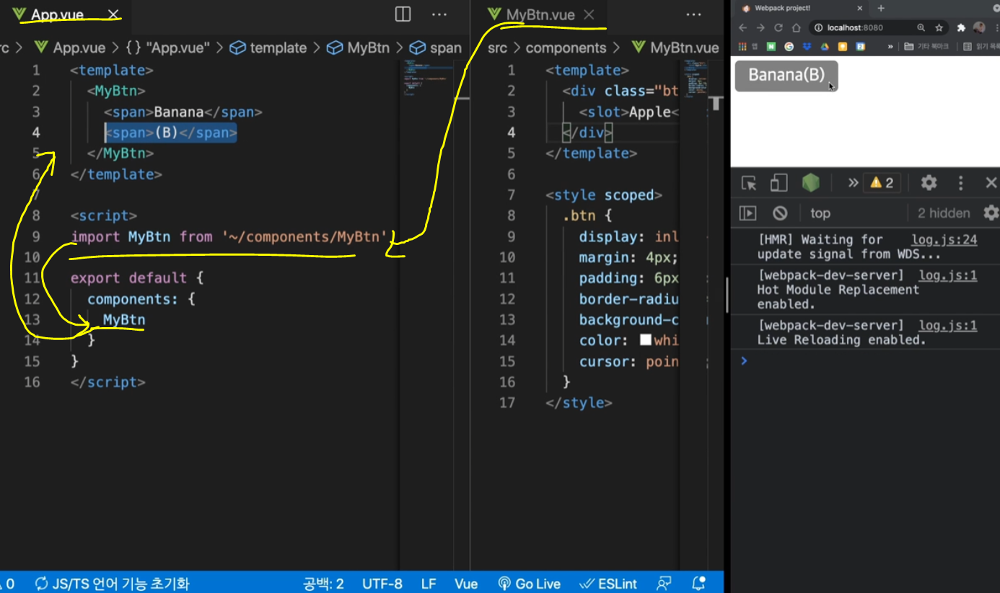
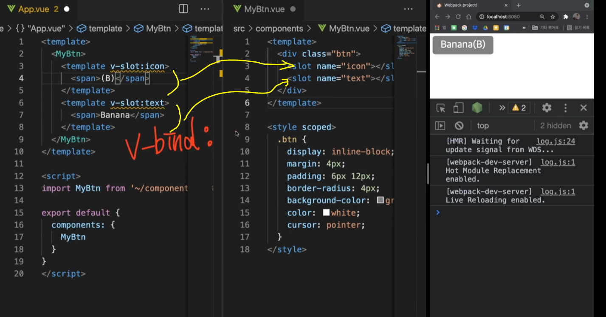
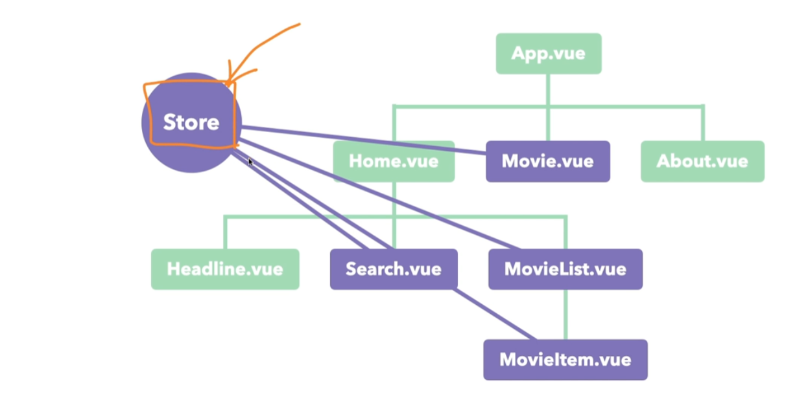
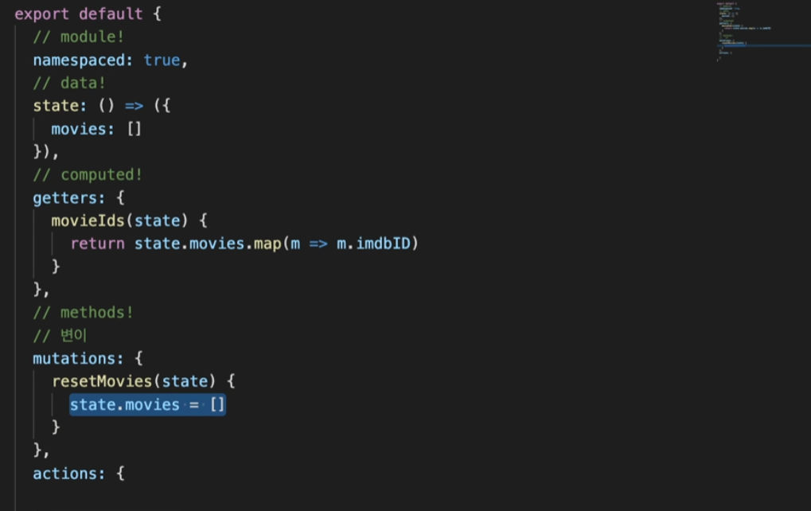
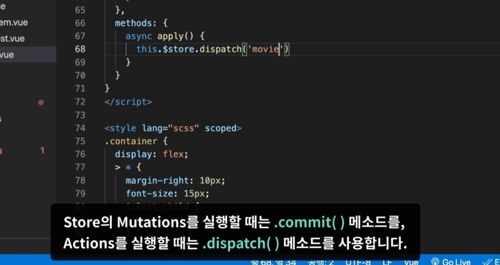
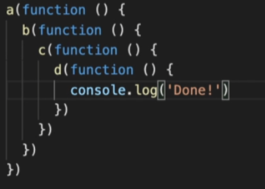
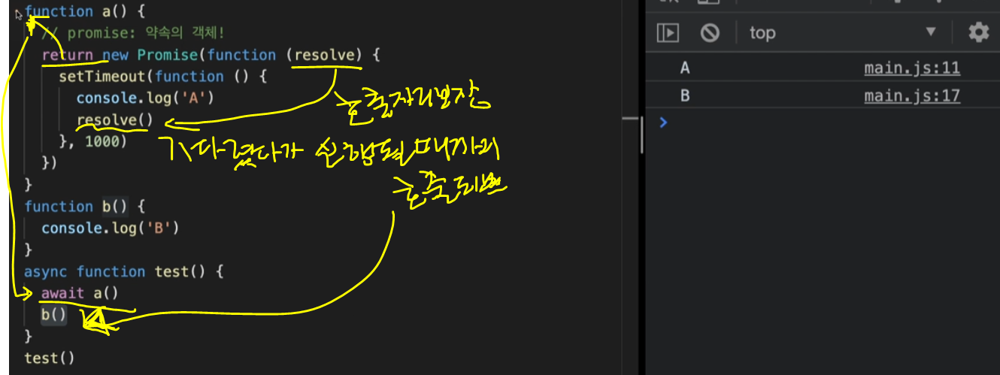
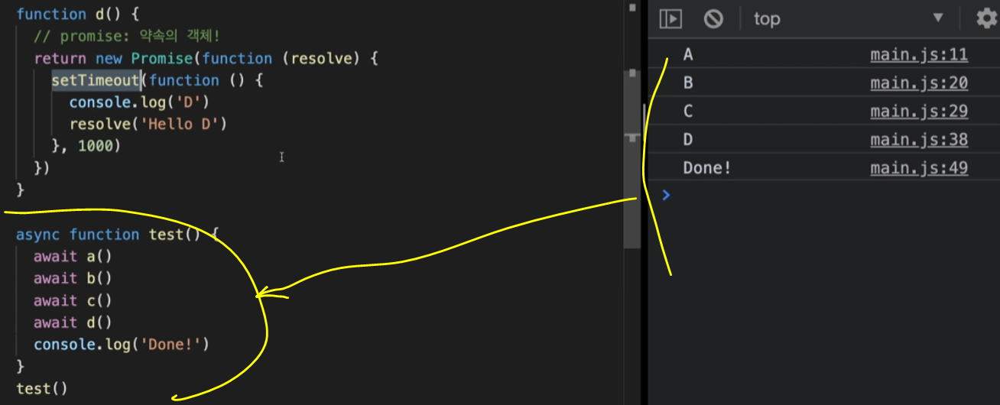
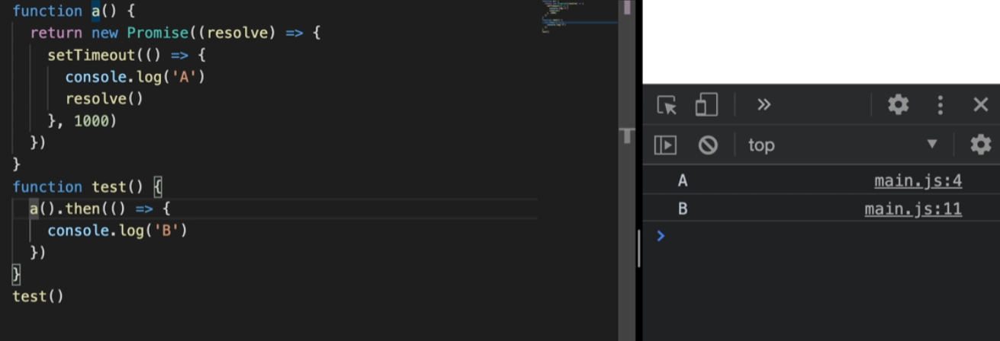

---

layout : single
title: ""

---

# Vue






App.vue의 순서가 뒤바껴도 MyBtn 안의 순서에 따라 출력된다.(slot 부분)


조상 components에서 자식 components 넘겨줄때 props 를 이용한다.

자식 components에서 후손 components 넘겨줄때 props 를 이용한다.

조상 components에서 후손 components 넘겨줄때 Provide/Inject를 이용한다.


vue-router next (404 페이지찾을수 없음 관련)

컴포지션 API

: 대형 프로젝트를 진행할 시, 변수와 함수가 서로 다른 공간에 위치하는 것은 하나의 기능을 한번에 보기에 매우 어려워짐.

따라서, setup이라는 함수를 제공하는 `컴포지션API` 함수 내에서도 기능별로 함수와 변수를 모아둘 수 있어 가독성이 좋아지며, 마치 Vanila Javascript를 작성하는 것처럼 Vue를 제작할 수 있게 한다.


flex-shrink: 1;

css 적용시 페이지 폭에 막혀 원하는 width가 안나올떄 0으로 바꾸면 설정한대로 나온다.


Vuex(Store) 개요

:중앙집중식 상태관리

데이터 전달에 있어 경로 최적화.




npm i vuex@next 설치.

store 폴더 생성 - index.js 파일 생성 

main.js에 

import store from './store/index.js'

createApp(App).use(store) 

여기서 use 는  vue.js 에서 사용할 수 있게금 플러그인 연결

mutations => 여기 에서만 데이터가 변경 가능하며 다른 컴포넌트에서는 변경할 수 없다.

관리가 복잡해지고 유지보수 어려움 떄문이다.




async await 비동기 관련 공부.



Object.keys() => 객체데이터의 속성들만 가지고 새로운 배열을 만들어 준다.


비동기-콜백과 프로미스 객체의 이해(promise)

코드가 작성된 순서대로 출력되는 함수 = `동기 방식`

순서대로 작성됬지만 순서대로 나오지 않을 때 순서대로 나올 수 있게 설정해주는 것 = `비동기 방식`



=> 콜백지옥

이를 해결하기위해 `Promise` 를 사용하여 해결 가능.

```
function a() {
	//promise : 약속의 객체!
	return new Promise(funtion (resolve) {
	
	})
}
```



```
async function test() {
	await a() 
}
// 비동기 함수 


```






 async await 사용이 불가능할 때 then 을 메소드체이닝 방식으로 쭈욱 연결해서 사용이 가능하다.
