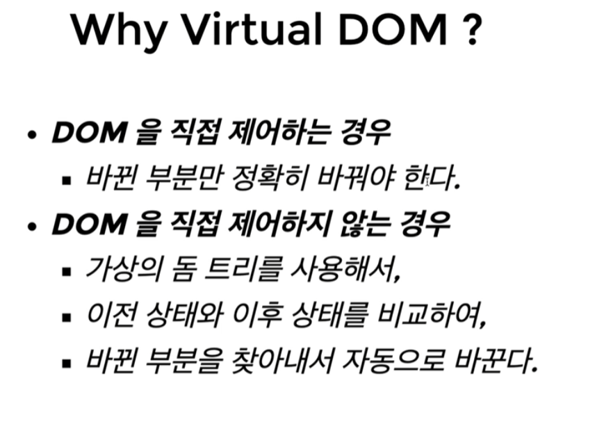
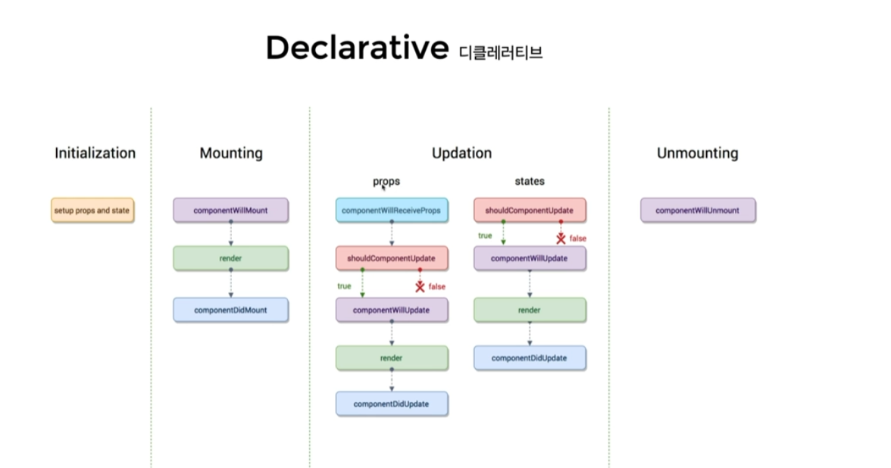

---

layout : single
title : " React 학습"

---

# React

https://slides.com/woongjae/react2021 (수업자료 Link)

1)React Getting Started

1-1)React Concept

Component Based Development


Virtual DOM = 화면에 있는 DOM을 직접 다루지않고 DOM을 다루는일을 리액트에게 위임한다.

라이브러리를 지원한다.



CSR(Client Side Rendering) : 


개발환경 체크

- Node.js
  - installer
  - nvm(노드버전매니저) : 노드의 버전을 변경할 수 있다.

ex) nvm install 14.16.1

```
//리액트 컴포넌트 -> HTMLElement 연결하기

=> import ReactDOM from 'react-dom';\

//리액트 컴포넌트 만들기

=>import React from 'react';
```


ReactDOM.render : 시작함수. html을 그려!! 라고 생각하면 된다.( main 이라고 생각하면된다.)


---

CDN을 통한 리액트 라이브러리 사용

**바탕화면 폴더생성. -> 해당 폴더로 이동(cd) -> npm init -y -> 이폴더를 파일서버처럼 운영할수있는** 

**npx serve 실행-**> 

실제 배포시에는 production cdn을 가져와서 넣어야함.

개인개발용으로는 development cdn을 가져와서 html에 넣는다

---

const Component = props => {

​	return React.createElement('p', p태그의 클래스 입력내용, p태그 안에 들어갈내용) //리턴될 떄 리액트엘리먼트로 되어야 한다.

} // 외부에서 props로받은 값을 사용한다. props.message 같은 형식으로 왜냐. 객체니까

ReactDOM.render(리액트 컴포넌트 , 리액트 컴포넌트가 그려질 곳 )

ReactDOM.render( React.createElement (Component, {message:init,count:0} ,  null) , 쿼리셀렉터 루트)

// 두번쨰는 실제 props에 넣어줄 인자


훅(Hooks) (리액트 컴포넌트 만드는 방법은 총2가지뿐이다.)


```
import React from 'react';
//정의 1번 방법
function FunctionComponent() {
	return <div>Hello</div>; // 필수로 써야함.
}
//사용
ReactDOM.render(<FunctionComponent/>, document.querySelectot(#root))

//정의 2번 방법
const FunctionComponent = () => <div>Hello</div>;
//사용
ReactDOM.render(<FunctionComponent/>, document.querySelectot(#root))
```


▶ 결과


```
<body>
    <div id="root"></div>


    <script crossorigin src="https://unpkg.com/react@17/umd/react.development.js"></script>
    <script crossorigin src="https://unpkg.com/react-dom@17/umd/react-dom.development.js"></script>
    <!-- 위에 선언을 통해 React와 ReactDOM 을 가져온것 -->
    <script type="text/javascript">
        console.log(React);
        console.log(ReactDOM);

        
    // React.createElement(
    //     type, // 태그 이름 문자열 , 리액트 컴포넌트 , React.Fragment
    //     [props], // 리액트 컴포넌트에 넣어주는 데이터 객체
    //     [...children] // 자식으로 넣어주는 요소들
    // )

    //1.태그 이름 문자열 type
    // ReactDOM.render(
    //     React.createElement('h1', null, `type이 "태그 이름 문자열" 입니다.`),
    //     document.querySelector("#root")
    // )

    //2. 리액트 컴포넌트 type
    // const Component = () => {
    //     return React.createElement('p', null, `type이 "React 컴포넌트" 입니다`)
    // }
    
    // //<Component></Component> => <Component/> => <p>type이 "React 컴포넌트" 입니다/p>
    // ReactDOM.render(
    //     React.createElement(Component, null, null),
    //     document.querySelector("#root")
    // );

    //3.React.Fragment => tag가 없이 내용만 출력이 된다.
    ReactDOM.render(
        React.createElement(
            React.Fragment,
            null,
            `type이 "React Fragment" 입니다.`
        ),
        document.querySelector("#root")
    )
    </script> 


</body>
```

---

### JSX

babel => 최신기술을 구버전에서 사용할 수 있게끔 구현을 시켜줄 때 사용한다.

JSX 문법으로 작성된 코드는 순수한 JavaScript 로 컴파일 하여 사용한다. 

누가 해주나요??  =? babel

(baveljs.io 사이트 가면 간단하 확인이 가능하다)

위 사이트에서 Setup 으로 이동한다음 prototyping 클릭해서 Usage의 cdn을 추가하면

작동을시켜준다.


ClassComponent 에서 state를 정의하는 방법.

항상 state 는 객체여야함


Eevent Handling

-  camelCase 로만 사용 할 수 있으며 , onClick 과 같이 on을 붙여줘야한다
- 이벤트 ={함수}와 같이 쓴다.
- 실제 DOM 요소들에만 사요 ㅇ가능하다.
- 리액트 컴포넌트에 사용하면, 그냥 props로 전달한다.


render = 웹브라우저에 처음 그려지기 시작

**리액트 컴포넌트 라이프사이클.** (v16.3 이전의 라이프사이클 훅이다. 17버전은 달라짐)



마운트 = render(최초 랜더)

`v16.3 이후의 컴포넌트 라이프사이클`

 


---

Creating React Project

https://create-react-app.dev (CRA)

리액트 애플리케이션을 만드는 것과 관련된 사이트.

`npx create-react-app` 프로젝트 명 => 프로젝트 생성어,

`cd 프로젝트명`,

`npm start`

작업을 끝냈을때 배포할 준비를 해야한다 그럴 때

`npm run build`를 사용 : 우리가 작업한 소스코드들을 최적화 해준다.

빌드된 프로덕션용 파일들을 어떻게 실행하냐? npm install -s build`를 리액트 애플리케이션용 파일 서버로 활용이 된다.


---

husky

커밋 후 깃으로 푸쉬하기전에 어떤걸 하고싶다!! 할 때 사용

git init으로 폴더를 연결시켜주고,

tic-tac-toe 프로젝트에 npm i husky -D,

package.json에 "scripts"부분에 "prepare": "husky install"을 설정해준다. 나중에 다시 패키지를 다른데서 설치해서 사용할때도 prepare을 돌면서 깃훅이 활성화 될것이다.

설치 후 허스키의 깃훅을 활성화 시키기 위해 npx husky install,

npx husky add .husky/pre-commit "lint-staged"로 파일 생성,

npm i lint-staged -D 설치 후 ,

lint-staged 설정을 해준다 package.json파일에

```
"lint-staged": {
	"**/*.js":[
		"eslint --fix",
		"pretter --write"
		"git add"
	] //어떤 폴더에 있던지간에 .js 확장자를 가진 파일을 해주겟다.
}
```

npm i prettier -D 설치 역시 해주고 Format On save 는 꺼주어야 한다.

pre-commit 파일 안의 lint-staged 내용을 npx lint-staged 로 바꿔줘야함.이유는 어떤 명령어인지 모르기 때문.

lint-staged : 커밋하려는 파일에 린터를 돌리고 싶을때 사용

팀에서 코드를 맞추고 푸쉬하기전에 강제로 맞추는 용도로 많은 팀이 사용하고 있다.


어떤 컴포넌트를 브라우저에 보여줄지에 대한 로직 = React Router

설치 방법 : npm i react-router-dom

-  cra에 기본 내장된 패키지가 아니다.
- react-router-dom은 Facebook의 공식 패키지가 아니다.
- 가장 대표적인 라우팅 패키지이다


```
순서대로
`npx create-react-app react-router-example`
`cd react-router-example`
`npm i react-router-dom`
```

src의 폴더를 만들고 거기에 .jsx 파일 3개를 만든다 그 후

```
ex)
xport default function Home() {
	return <div>Home 페이지 입니다.</div>
}
export default function profile() {
	return <div>profile 페이지 입니다.</div>
}
export default function about() {
	return <div>about 페이지 입니다.</div>
}

```


동적 라우팅


---

노태환 강사 2022-01-06

구현 환경 : codesandbox.io

- 별도 환경설정 필요없이 코딩 가능, 쉬운 코드 공유
- 무료요금제(모든코드가 외부에 공유됨)

Modern JavaScript 튜토리얼 -> 공부하기 추천

---

Switch 와 NotFound


Switch문안에 넣어주면 맞을경우에만 해당하는 곳에 들어간다.

Home부분은 exact부분이여야한다. 이유는 나머지위에서 맞지않는경우 루트경로인 Home으로 들어가게된다

exact를 빼게되면 모든경로는 루트경로를 갖게된다.


JSX 링크로 라우팅 이동하기

a태그로 리액트에서 이동하게 될 경우 문제가 발생한다.

브라우저의 특정 새 경로를 입력해주는 것과 다를바없기 때문에 아래 특징과 맞지 않다.

```
React-Routing의 특징

서버에서 다른페이지를 새로 가져오는게 아니라 리액트애플리케이션 내부에있는 이 경로에 맞는 다른페이지를 보여주는 용도로만 라우팅 처리가 된다.
```

Link 컴포넌트를 사용한다!!


NavLink 경로가 매칭이되어 맞는다 판단된다면, 스타일 지정을 해준다.


 **Styled Components 라이브러리**

`npm i styled component`

class 를 지정하지않았는데도 추가가 된다.


Styled Components 에서도 전역으로 css 속성을 적용시킬수 있다.

const GlobalStyle = createGlobalStyle``

``안에는 스타일을 넣어주는 곳이다.

import styled, {createGlobalStyled} from "styled-components";를 해서 가져온다           


**React Shadow**

본래의 html안에 영향을 주지않는 html이 있다고 생각하면 편하다.

`npm i react-shadow`


Ant Design

`npm i antd`

index.js 의 importt "./index.css" 위에 impot " antd/dist/antd.css"를 추가해줘야 antd 를 먼저 적용후 우리걸 적용하는 방식으로 할 수 있다.

사이트 : ant.design

어떤 컴포넌트를 넣으면  그 모습으로 나온다.

Icon 패키지는 =>  또 다른걸 설치해줘야한다  사이트참조! !


`HOC ; Higher-Order Components`

최근에는 중요도가 낮아짐.

이와 비슷한 역할을 하는 Hook이 나왔기 때문에 사용량이 줄어드는 추세.


Basic Hooks

`useState`,  `useEffect`

useState를 사용하는 이유.


useReducer : 

 => 다수의 하윗값을 포함하는 복잡한 정적 로직을 만드는 경우 사용

 => 다음 state가 이전 state에 의존적인경우

ex)

```
const [state, dispatch]=useReducer(reducer, {count: 0});
//

```


 컴포넌트간 통신

상위컴포넌트와 하위컴포넌트 의 2가지 방식으로 가능.

중간의 props로 데이터를 전달해주는 컴포넌트들은 관리하는데 있어 주의해야한다.

이러한 것들을 해결하기위해 제안되는 방식을 학습해본다.


해결방안 : Context Api 를 통해 해보자.

데이터를 Set하기

1.context를 생성한다.

2.context.프로바이더를 사용한다

3.value를 사용한다


```
import React from 'react'

const 이름 = React.creatContext();
export default 이름

하고 index.js 에서는
<이름.Provider value={}/>
```


jest 

폴더만들기 -> 폴더경로이동->npm init -y (npm 프로젝트로 만들기)-> npm i jest -D

package.json

"scripts" 부분에 


클래스컴포넌트는 16.8.0 부터 hook을 주로 쓰기때문에 잘 안쓴다

```
test('adds 1+2 to equal 3', () => {
	expect(1+2).toBe(3)
})
```


test 코드를 분야별로 묶는거 describe('', () => {});


npx jest --watchAll : 항상 테스트가 켜져있는 상태가 된다 일일히 npm test 안해도됨

jest 는 기본으로 깔려있음. 별도의 패키지 설치 필요 x

그 후 a 를 누르면 app.test.js 를 test할 준비가 된다.


React Advanced 

1.Optimizing performance : 필요할때만 렌더한다.


현업 추가 팁: redux toolkit으로 쓰면 더 쉽고 거기에 타입스크립트로  쓰면 큰 프로젝트 스케일링하기도 편합니다.


---

리덕스 미들웨어 

- action이 dispatch 된 다음, reducer에서 해당 action을 받아와서 update하기 전에 추가적인 작업 가능
- 주로 비동디 작업을 처리할 때 사용됨
- redux-thunk, redux-saga를 많이 사용한다.


redux-thunk : 


`npm i redux-thunk` 

미들웨어는 함수이다.

import thunk from "redux-thunk"


Ducks Pattern : redux를 이러한 패턴으로 작성하니 좋다.


`npm i react-router-dom`

`npm i connected-react-router` : router 를 redux로 관리하고 싶을떄 쓴다

---

redux actions

=>` npm i redux-actions`

```

import { createAction } from "redux-actions";

console.log(createAction("Hello")("안녕하세요"));
```


**따라서 , createAction 을 수행한 결과무이 액션 생성 함수가 된다.!**


---


redux-saga

`npm i redux-saga`


### React로 나의 책장 만들기

`npx create-react-app my-books -- template typescript `

`npm i react-error-boundary` : componentDidCatch 만약 런타임 시 에러가 발생하게되면 에러페이지로 FallBack시켜준다.


---

## Next.js

**Next.js**는 **React** 어플리케이션의 서버사이드렌더링(SSR)을 쉽게 구현할 수 있게 도와주는 프레임워크입니다.  

**nextjs**프로젝트의 기본적인 세팅을 간편하게 시작하는 방법은 **create-next-app**을 사용하는 것입니다.

**react / react-dom / next** 가 함께 설치되며, 간편하게 프로젝트 구조를 잡을 수 있습니다.

### **환경 설정 하기**

#### **시스템 요구사항**

\- Node.js 10.13 or later

\- MacOs, Windows (including WSL), and Linux are supported

 

**Node.js** : 자바스크립트 런타임 

**NPM** : 패키지 매니저 도구

**Yarn** : 개선된 버전의 NPM


 기본적으로 Node.js, NPM or Yarn 이 설치되어 있어야 하고, 편집기로는 VSCode를 사용하도록 하겠습니다.  


1. npx create-next-app [프로젝트 명]
2.  index.js 가 메인 페이지이다.


## 리덕스는 언제 쓰는게 좋을까?

그렇다면 리덕스는 언제 쓰는게 좋을까? 이 질문에 대한 답은 [리덕스의 공식문서](https://redux.js.org/faq/general#when-should-i-use-redux)에 나와있다.

- 앱의 여러 위치에서 필요한 많은 양의 상태들이 존재할 때 (전역 상태가 필요하다고 느껴질 때)
- 상태들이 자주 업데이트 될 때
- 상태를 업데이트 하는 로직이 복잡할 때
- 앱이 중간 또는 큰 사이즈의 코드를 갖고 있고 많은 사람들에 의해 코드가 관리될 때
- 상태가 업데이트되는 시점을 관찰할 필요가 있을 때

